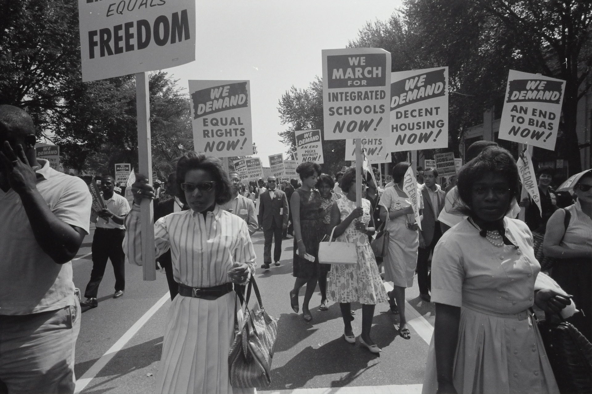
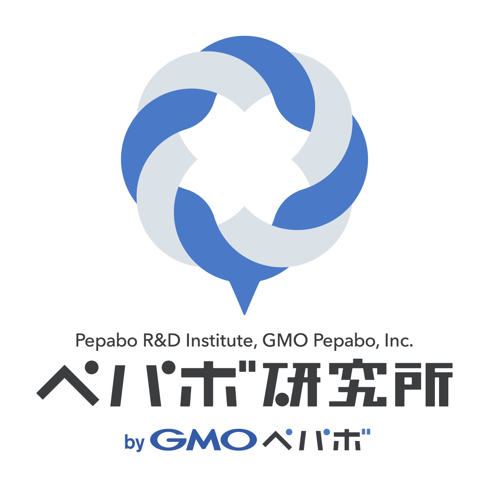
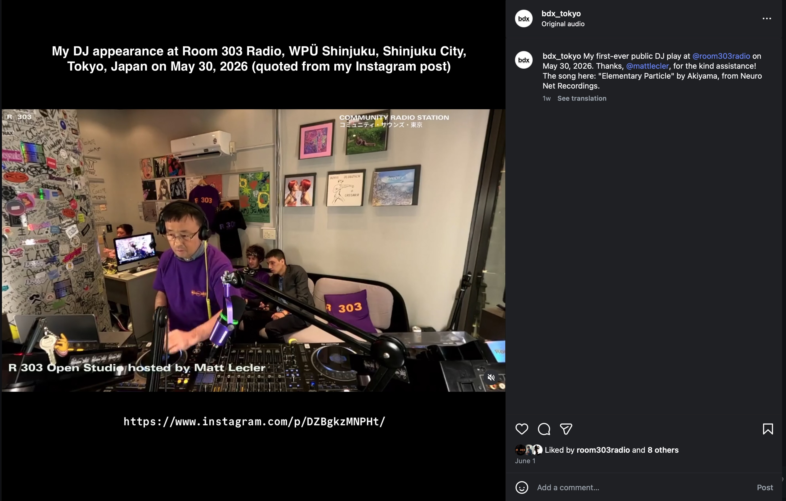

theme: Zurich
footer: Kenji Rikitake / oueees 20260623 topic00
slidenumbers: true
autoscale: true

# [fit] oueees-202606 topic 00

## [fit] 電気工学特別講義

## [fit] 2026年6月23日分 イントロダクション

<!-- Use Deckset 2.0, 16:9 aspect ratio -->

^ 大阪大学基礎工学部 電気工学特別講義 2026年6月23日分 イントロダクションです。

---

# Kenji Rikitake

23-JUN-2026
School of Engineering Science, The University of Osaka
On the internet
@jj1bdx

Copyright ©2018-2026 Kenji Rikitake.
This work is licensed under a [Creative Commons Attribution 4.0 International License](https://creativecommons.org/licenses/by/4.0/).

^ 講師の力武 健次といいます。よろしくお願いします。

---

# CAUTION

The University of Osaka School of Engineering Science prohibits copying/redistribution of the lecture series video/audio files used in this lecture series.

大阪大学基礎工学部からの要請により、本講義で使用するビデオ/音声ファイルの複製や再配布は禁止されています。ご注意ください。

^ 大阪大学基礎工学部からの要請により、本講義で使用するビデオ/音声ファイルの複製や再配布は禁止されています。ご注意ください。

---

# Lecture notes and reporting

* <https://github.com/jj1bdx/oueees-202606-public/>
* Check out the README.md file and the issues!
* Keyword at the end of the talk
* URL for submitting the report at the end of the talk

^ レクチャーノートはGitHubのこのURLに掲載しています。講義の最後に各回のキーワードとレポート提出のためのURLを示します。

---

# [fit] 2026: a year of uncertainty and hype

* Oil supply shortage since 1973, *53 years ago*
* 12 years since Russo-Ukrainian war began in 2014
* 6 years since COVID-19 started in 2020
* Soaring Nikkei 225 index (~35 years since the bubble economy in 1980s)
* IPOs of major AI companies: OpenAI (ChatGPT) and Anthropic (Claude)

^ 2026年は不確実性と異常な興奮が同時にやってきている年になりました。

---

# [fit] 2026: the hard-cold reality of color ink shortage [^1]

[^1]: [カルビー株式会社, "中東情勢の影響による一部商品仕様見直しのお知らせ", May 12, 2026,](https://www.calbee.co.jp/news/pdf/4227-34957.pdf)

^ とはいえ、普通に生活していたら、ポテトチップスの包装を白黒にしなければ商品が販売し続けられなくなるという、53年前の石油ショックでも見なかった異常な事態になっていることがわかります。これは政治の失策としかいいようがありません。ただの「目詰まり」でこんなことになるはずがありません。

---

# [fit] War zone everywhere

- Hormuz Strait and USA-Iran war since March 2026
- Gaza Strip has become a wasteland since 2023
- Conflict escalation everywhere in the world
- *Japan is not an exception*

^ 今年は戦争の年でもあります。ホルムズ海峡をめぐる米国とイランの戦争はもう3ヶ月になりました。ガザの紛争は3年以上続いています。世界中で緊張が高まっています。日本もまた例外ではありません。

---

# [fit] Japan has already engaged in the wars

- Japan has most deeply committed in the military and peace-keeping activities on regional conflicts since 1952
- Always remember: *open and fair trade is the only way to survive for a country like Japan* which **does not have sufficient natural resources**

^ 忘れてはならないことは、日本はこれらの地域紛争や貿易戦争に、すでに深くかかわる立場を持って活動しているということです。1952年にサンフランシスコ平和条約が締結されて以来、日本がこれだけ地域紛争や平和維持活動に深くかかわったことはないでしょう。そして日本のように十分な天然資源のない国にとって、自由貿易こそが唯一の生存方法であることは忘れてはならないと思います。

---

# [fit] How can we survive in Japan?

- The levels of tension in the regional conflicts which Japan is engaged in are rising to much higher levels than those in the cold war during 1945-1991
- Japan started the Pacific War because of oil embargo in 1941

^ 私は1965年生まれの61歳です。1980年代半ばから後半に過ごした学生時代は、世界は冷戦まっただ中でした。当時も欧州では戦術核兵器が使われる可能性が取り沙汰されていました。しかし、現時点で日本がかかわっている地域紛争の緊張レベルというのは、1945年から1991年まで続いた冷戦時代よりもはるかに高く厳しいものだと思っています。そして1941年の太平洋戦争開戦の理由の1つが、米国による石油禁輸であったことを忘れてはなりません。我々はいつ現在のイラン同様の立場に立たされてもおかしくはないのです。

---

# We need to change our perspectives

- We are under the process of revising our understating of how the world is built and formed
- It's not just about the economics and technology
- It's more about the scarcity of resources and redistribution

^ 現在我々は世界がどのように作られて形成されてきたかの認識を根本的に変える過程にあるのだと思います。それは経済や技術だけでなく、資源がどれだけ希少であるか、そしてその再配分をどう行うかの問題を考えなければなりません。

---

# [fit] Infrastructure crises

- Broken supply chains: crude oil, rare-earth minerals, natural gas
- Fragile supply chains: food and semiconductors
- Global warming and energy and water shortage

## [fit] *Are we heading into the apocalypse?*

^ 現在、いろいろなところでインフラストラクチャー、あるいは社会基盤の危機が続いています。ヨーロッパでは今や航空機燃料は貴重品になってしまい、民間航空機の減便が相次いでいます。中国から日本が制裁を受けているレアアースの不足、ホルムズ海峡の封鎖に伴うナフサ不足、どちらも簡単に解決できるものではありません。サプライチェーンが壊れたことにより、食料危機や半導体不足が起こっています。また原油や天然ガスの供給不足、そしてそのことを戦争遂行に利用する勢力によって、エネルギー価格の高騰が発生しています。地球温暖化による水不足や電気不足も起こっています。21世紀に入ってずっと語られつづけているのは、世界の終わりに向かって人類が突き進んでいるのではないか、ということです。普段生活しているとそんな感じは全然しないんですが、その認識自体が問題なのかもしれません。

---

# Logistics is digital

- Physical ubiquity and software world are co-dependent
- We need ample supplies of daily necessities to keep AI running
- Can we maintain this?

^ 社会基盤の話に欠かせないのが、実はこの講義でも使うソフトウェア、インターネットとAIの話です。21世紀以降の在庫管理はいかに在庫を持たずに効率よく経営するかが前提になっていて、そのためには物流を途絶えさせないことが必須です。そうなるとコンピュータの助けなしには実現は不可能です。つまりモノを潤沢に回すこととソフトウェア・ファーストな世界は実は共依存関係にあります。どちらがコケてももう一方がダメになってしまうわけで、そんな状況で本当に世の中続けていけるのか、という疑問は常に持たざるを得ません。

---

#[fit] We need to survive, anyway

- Staying alive is hard
- Safety first is precious
- Getting out of slavery is extremely difficult

## [fit] *We need to prevent slavery* 

^ こんな状況下では、もちろん自分達の安全を守ること、生き続けること、自分達が戦って奴隷的立場から脱出することは当然として、人を奴隷にすることを防がないといけないわけです。この講義で説明するインターネット技術も、自由と平等のためのものでなければならないと、私は考えています。

---

# [fit] Slavery is everywhere

^ そして世界中の権力者によって、弾圧されたり辺境に追いやられている人達が、奴隷のように扱われて残酷かつ不平等な扱いを受けているわけです。現在の米国のICEによる移民摘発政策を見ていると、誰もが追われる立場になりかねないことがよくわかります。この背景は1963年の米国公民権運動の写真です。今でも黒人や女性の人権は米国では十分守られているとは言えませんし、2025年1月以降の米国政府執行部は60年前と同様の人権抑圧ともいえる政策を再度実行しつつあります。

---

# [fit] Slavery is everywhere

- Cruelty and inequality going on everywhere by people with power to enslave oppressed and marginalized people
- Who are *the marginalized people?* *You can be one at any time*

<!-- https://www.weforum.org/publications/global-gender-gap-report-2025/in-full/benchmarking-gender-gaps-2025/ -->

^ 日本でも同様の問題が程度は異なるものの本質的には変わらないまま100年以上続いています。現在の政権が推進している家父長制の固定や外国人排除の政策は憂慮すべき事態です。そして昨年の統計ですが、世界経済フォーラムが2025年6月11日に発表したジェンダーギャップ指数では、日本は148の国や地域のうち118位となっています。

---

# [fit] So what can we do?

- Technology is for the people, *not for the billionaires*, and *never for the oppressive organizations*
- Can we keep our technology free? 

^ こんな状況下でなにをどうすればいいのかですが、1つ言えることは、技術は金持ちのためでもなく、ましてや抑圧する側の組織のためのものでもないということです。そして我々は技術の自由を維持できるのかということは、常に考えなければなりません。

---

# [fit] Who I am / 自己紹介

- Software engineer, *formerly called himself Professional Internet Engineer*
- 技術士（情報工学部門）
- 力武健次技術士事務所 所長
- 情報処理安全確保支援士

^ 前置きが長くなりましたが自己紹介です。かつてはプロフェッショナル・インターネット・エンジニアと名乗っていました。今はソ
フトウェアエンジニアと簡単に名乗っています。今は技術士の仕事をしています。技術士は建設業で一般的な資格ですが、私は情報工学部
門、つまりコンピュータ関連での調査研究をしています。自分の名前を付けた技術士事務所の名前を個人事業主の屋号にしています。また、情報セキュリティの資格である情報処理安全確保支援士の仕事もしています。

---

# My research work

- Guest Researcher, Pepabo R&D Institute, GMO Pepabo, Inc. 
- GMOペパボ株式会社 ペパボ研究所 客員研究員

^ 主な研究の仕事の一つとして、GMOペパボ株式会社のペパボ研究所の客員研究員、そして同社の技術顧問として日々の業務からインターネットそして世界をどうやって研究開発の視点からもっとおもしろくしていくかに取り組んでいます。

---

# My career

- Erlang/OTP, Elixir, C, VAX/VMS now OpenVMS, FreeBSD, Linux, TCP/IP, PHP, mruby, Lua, C++, C#, Visual Studio, Moodle, macOS, Windows, Vim, VS Code, Arduino, AVR, radio engineering, music, distributed systems, fault tolerance, software defined radio, Python, R, signal processing, x86_64 AVX, HTML, CSS, JavaScript, TypeScript, adaptive filter, machine learning / deep learning, LLM and AI apprentice, Claude Code prompting, Kermit protocol, whatever
- 36 years in Computer Science, 21 years since PhD, 50 years of ham radio op as @jj1bdx, 2010-2012: Professor, ACCMS/IIMC, Kyoto University, ACM Senior Member, amateur DJ and musician, whatever

^ 自分の職業としてはいろいろなことをやってきました。1990年に最初に社会人として就職してからもう36年になります。阪大の情報科学研究科で博士号を頂いてから20年が経過しました。京大の教授をやっていたこともあります。

---

^ そして今年2026年の5月末には新宿のRoom 303 RadioというインターネットラジオにてDJとして曲をかける実績を解除しました。

---

# My recent career is not a brilliant one, though

- I've got laid off on June 2013
- >13 years of ongoing survival
- as an independent IT consultant
- and a *software engineer*

^ とはいえ、13年前の2013年6月には、当時の勤務先から戦力外通告を受けました。会社都合退職といえば聞こえがいいですが、要するにクビになったわけです。その後は日々試行錯誤しながら、ITコンサルタントとソフトウェアエンジニアとして、必死に生きてきました。今年2026年の4月で、個人事業開業12周年になります。

---

# [fit] Past records are meaningless

- You need to live your life and earn money
- ... then you can work on what you really want to do

^ この13年ずっと肝に銘じていることは、過去の業績というのは何の役にも立たないこと、そして人生にとって一番大事なのはまず自分の人生を生きてしっかりカネを稼ぐこと。それをやって初めて自分の好きなことをやることができる、ということですね。

---

# [fit] Ignore past achievements

# [fit] Focus on *now*

^ 過去の業績に囚われずに、今に集中する。それしかありません。

---

# [fit] Ignore everybody

# [fit] to stay creative and maintain originality

^ あとは、自分の創造性と独自性を保ち続けるためには、他人は全員無視する、ということでしょうか。ソーシャルメディアの世の中になった現代では、他人の意見が怒涛のごとく流れてくるので、よほど自覚して自分を守らないとすぐに流されてしまいます。流されることを防ぐためには多少迷っても世間の付き合いとかしがらみを切っていかないといけない、と日々思って実行しています。

---

# [fit] Information delivery on internet

- Our lecture theme

^ この講義のテーマは、「インターネットの情報伝送」です。

---

# [fit] How internet works

(In other words)

^ 言い換えれば、どうやってインターネットが動いているか、の基本に触れるべく話をしていきます。

---

# [fit] 容錯設計

# [fit] Fault-tolerant design

^ 第二次大戦後に、フォールトトレラント、平たくいえば何か障害や事故が起こってもシステムを止めずに動かし続ける技術というのが追求されてきました。これを表現する4文字の中国語を日本語で読むと、「ようさくせっけい」、つまり錯誤を容認する設計、と書くそうです。今のインターネットは、このフォールトトレラントな設計のひとつの実装を実現したもの、ということがいえます。

---

# [fit] Internet is

# [fit] a survival technology

^ このイントロダクションでずっと「生き抜く」ことについて話をしてきましたが、インターネットもまたサバイバルのための技術だということがいえると思います。

---

# [fit] Modern life is full of failures

# [fit] How internet works under failures?

^ 現代の生活はちょっとしたことで電気が止まったりコンピュータが動かなくなったりするという事故に溢れているわけです。そんな状況下でどうやってインターネットを動かし続けるかということを考えなくてはいけません。

---

# Technology 1:
# [fit] Packet switching

^ この講義では主に3つの要素技術について触れていきます。ひとつめはパケット交換についてです。

---

# Technology 2:
# [fit] Flexible packet routing

^ 2つめはパケットをどの経路で通すかを柔軟に制御する技術です。

---

# Technology 3:
# [fit] Centralization and decentralization

^ 3つめは集中と脱集中という技術の実装におけるシステムの組み方や特徴の違いについて話します。

---

# Topic sections (1/3)

* Latency and Laws of Physics
* Centralized communication
* Multiplexing
* Packet switching
* Routing basics

^ 具体的な話題として、物理の法則と遅延、集中型コミュニケーション、多重化、パケット交換、基本的な経路制御、

---

# Topic sections (2/3)

* IP addresses
* Routing in details
* Network transports
* Cloud computing basics
* Social implication of cloud computing

^ IPアドレス、経路制御の詳細、ネットワークトランスポート、クラウドコンピューティングの基本とその社会的な影響について、

---

# Topic sections (3/3)

* Network fault-tolerance
* Network services and programming trends
* Wireless/radio and internet
* Information warfare and radio surveillance
* "Artificial Intelligence" and the reality
* Reference books
* Career choice

^ そしてネットワークのフォールトトレランスあるいは耐障害性、最近のプログラミング、無線とインターネット、情報戦と無線の監視、AIとその現実、参考文献、最後に社会人としての進路選択について話していきます。

---

# Summary:

- Divide data into packets
- Route flexibly and wisely
- Decentralize and distribute

^ 話の概要としては、データをパケットに分割し、そのパケットを柔軟かつ賢く経路制御して、集中させることなく分散して配送していく、というのがインターネットの情報伝送の基本的なことですね。

---

# [fit] Let's get down to business!

^ それでは前置きが本当に長くなってしまいましたが、本題に移ります。この後にイントロダクションのキーワードがあります。

---

# Photo credits

* 1963 Civil Rights March: by [US Library of Congress](https://unsplash.com/@libraryofcongress) on [Unsplash](https://unsplash.com/photos/civil-rights-march-on-washington-dc-WzPxmB_tRlw), rescaled and edited by Kenji Rikitake
* Pepabo R&D Institute logo is used by permission of GMO Pepabo, Inc. 

<!-- Photo and image credits here -->

<!--
Local Variables:
mode: markdown
coding: utf-8
End:
-->
