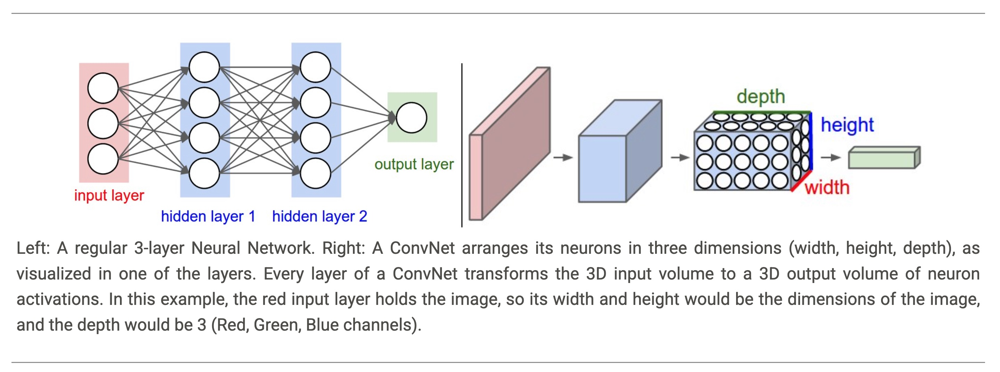

theme: Zurich
footer: Kenji Rikitake / oueees 20260623 topic01
slidenumbers: true
autoscale: true

# oueees-202606 topic 01:

- Internetworking behind AI
- or how to build the gigantic computing infrastructure

<!-- Use Deckset 2.0, 16:9 aspect ratio -->

^ ここ数年、日本語では人工知能と称される、Artificial Intelligence (AI)の発展、およびその技術的社会的影響が話題になっています。今回は、本講義のテーマである「インターネットの情報伝送」の視点から、AIの背後にあるインターネットワーキングあるいは相互接続の技術について、ざっと見ていきます。

---

# Kenji Rikitake

23-JUN-2026
School of Engineering Science, The University of Osaka
On the internet
@jj1bdx

Copyright ©2018-2026 Kenji Rikitake.
This work is licensed under a [Creative Commons Attribution 4.0 International License](https://creativecommons.org/licenses/by/4.0/).

^ 講師の力武 健次です。よろしくお願いします。

---

# CAUTION

The University of Osaka School of Engineering Science prohibits copying/redistribution of the lecture series video/audio files used in this lecture series.

大阪大学基礎工学部からの要請により、本講義で使用するビデオ/音声ファイルの複製や再配布は禁止されています。

^ 大阪大学基礎工学部からの要請により、本講義で使用するビデオ/音声ファイルの複製や再配布は禁止されています。ご注意ください。

---

# Lecture notes and reporting

* <https://github.com/jj1bdx/oueees-202606-public/>
* Check out the README.md file and the issues!
* Keyword at the end of the talk
* URL for submitting the report at the end of the talk

^ スライド等が読みにくい場合は、レクチャーノートをご利用ください。

---

# Topic of this video:
# [fit] Internetworking behind AI

^ 今回は、AIの背景にあるインターネットワーキングの技術とはどんなものなのかについて、基本的なことを解説していきます。

---

# What we call AI is a computing service

- ChatGPT, Claude, Gemini are NOT on a single computer; they are *distributed*
- AI is a collective service running on *massive number of clusters of computers*
- Localized AI exists, but the scale is smaller than commercial AI services

^ 私達がAIと普段呼んでいるもの、たとえばOpenAIのChatGPT, AnthropicのClaude, そしてGoogleのGeminiは、単独のコンピュータで動いているわけではなく、分散した複数のコンピュータ上で動いています。これらは大量のコンピュータを集めたクラスタの上で動く集合的サービスとして実現されています。もちろんパソコンや組織内のコンピュータシステム上でローカルに同じようなサービスを実現はできますが、その規模は商用AIサービスに比べて小さくならざるを得ません。

---

# What do AI services actually?

- They compute huge models of neural networks of an undisclosed scale
- They run Large Language Models (LLMs)
- Open-source models include 1-trillion parameters with active 30- to 50-billion ones [^1]

[^1]: [Carolyn Weitz, "Best Open Source LLMs: Benchmarks, Licenses, Local Deployment and Enterprise Use Cases", AceCloud, Last Updated: May 13, 2026](https://acecloud.ai/blog/best-open-source-llms/)

^ AIのサービスは実際に何をやっているのかについて説明します。非常に大きな規模のニューラルネットワークの計算をやっていることは確かですが、著名なAIサービスの多くはその規模を開示していません。その上で走っているのは大規模言語モデル（LLM）の計算です。オープンソースのモデルでもパラメータ数は1兆におよび、そのうち有効なものは30億から50億あるとされています。つまり数十億次元の規模の行列計算をやっているのだと考えると、その複雑さが想像できるでしょう。

---

# What does AI compute for the neural networks?

- Linear algebra + statistical functions
- Equivalent to huge (> 1B x 1B) matrix computation
- Randomization during the computation involves
- *Non-deterministic output for the same input*

^ AIはニューラルネットワークのためにどんな計算をしているのでしょうか。実際には10億次元以上の行列計算に相当する計算を、より小さな行列と統計的関数の計算に分解して行っています。この際結果を固定しないために、計算の過程でランダム化も導入されています。つまり、同じ入力に対して、同じ結果が決定的に返ってくるわけではありません。

---

# Convolution by multiple neural networks [^2]

[^2]: [Convolutional Neural Networks (CNNs / ConvNets), CS231n: Deep Learning for Computer Vision, Stanford University, Spring 2026](https://cs231n.github.io/convolutional-networks/)

^ ニューラルネットワークにもいろいろな種類があります。この図に示したのは畳み込みニューラルネットワークの様子です。2010年代から画像認識の技術として発展しています。画像が何を示すかという特徴量を抽出するために、複数の層を作って局所的な情報を抽出しながら、最後に1つの特徴量に集約する様子を示しています。

---

# Large Language Models (LLMs)

- A neural network trained on a vast amount of text for natural language processing tasks, *especially language generation* [^3]
- Generative pre-trained transformers (GPTs): no recurrent pre-trained on large datasets of unlabeled content, and able to generate novel content [^4]

[^3]: [Large language model](https://en.wikipedia.org/w/index.php?title=Large_language_model&oldid=1359256792), Wikipedia, (last visited June 16, 2026), emphasis by Kenji Rikitake.

[^4]: [Generative pre-trained transformer](https://en.wikipedia.org/w/index.php?title=Generative_pre-trained_transformer&oldid=1359155079)(last visited June 16, 2026).

^ 一方最近広く使われているGenerative AI、あるいは生成AIと呼ばれるものは、大規模言語モデル（LLM）を基にしています。LLMは自然言語処理のために大量の文章を学習していて、言語的生成が得意です。これの代表的な実装が一般的事前学習済みトランスフォーマー（GPT）で、ChatGPTの名前の一部にもなりました。GPTの元になったトランスフォーマーの技術は、出力を入力に戻さずに実行できるため、高速で並行処理化がしやすいという利点があります。トランスフォーマーの細かい説明は割愛します。

---

# So how do you run an LLM on computers?

- GPUs with large-scale memories and high bandwidths 
- Example: NVIDIA H100 Tensor Core GPU [^5]
  - Architecture: Hopper
  - Memory: 80GB HBM3
  - Memory Bandwidth: 3.35 TB/s
  - Tensor Performance: Up to 3,958 TFLOPS (FP8)
  - Power: 350-400W (NVL) / 700W (SXM)

[^5]: [Deborah Emeni, 12 best GPUs for AI and machine learning in 2026, Northflank](https://northflank.com/blog/best-gpu-for-ai)

^ LLMを満足に走らせるためのコンピュータには、Graphics Processing Unit (GPU) という、もともとは画像処理要に作られた行列演算などを得意とする処理装置が必要です。一般的なNVIDIAのH100というGPUには、80GBのメモリが乗り、3TB/sつまり一般的なUSB 3.2 SSDの転送速度400MB/sの8000倍近くのメモリ帯域が必要で、サーバーPCI Expressモジュール(SXM)だと700W、NVIDIAのNVLinkを使ったものでも400Wの電力を消費します。

---

# Massive computing needs massive resources

* Each LLM inference occupies an entire GPU
* Electric power to run the GPU servers
* Water and electricity to *dissipate heat*
* Land to place the servers for the *data centers*
* Internet bandwidth to utilize the GPUs

^ 一般的にLLMのモデル1つあたり最低でも1つのGPUを必要とします。このことから、AIを実行するコンピュータサービスでは、非常に多くの電力、大量の冷却用の水、そしてGPUを含むサーバーを置くための広大な土地が必要になります。これらは大量のデータを消費し生成するので、十分に使い切るためのインターネット接続帯域も確保しないといけません。

---

# High bandwidth needs shorter latency and mass interconnects between distributed servers

- Minimize latency locally, regionally and globally
  * Data center building rush in many countries
- Interconnecting servers *within* the data center
  * Optic fiber networks (~400Gbps)
  * Highly-efficient protocols *other than* Ethernet and TCP/IP
  * Backplane interconnect: up to 112Gbps and 50GHz [^6]

[^6]: [High-Speed Backplane Interconnect Solutions Quick Reference Guide, TE Connectivity (PDF)](https://www.te.com/content/dam/te-com/documents/consumer-devices/global/dnd-br-high-speed-backplane-connector-en.pdf)

^ ここからようやくネットワークの話に入っていきます。AIの性能を引き出すには、遅延をローカル、地域、国境や大陸を越えたグローバルなレベルで、最低にしなければなりません。100Gbpsの速度だと、1マイクロ秒遅れても100000ビット、つまり12.5キロバイトの遅延が出てしまいます。これが故に、世界の各地域での高速化を目指すため、地域でのデータセンター建設が盛んになりつつあります。日本では東京近郊の千葉県などが著名です。そして同様に、データセンターの中の機器同士の相互接続に使うインターコネクトの速度も上がっています。400Gbpsの光ファイバーはすでに一般的ですし、プロトコルの効率を上げるためイーサネットやTCP/IP以外での接続も一般的になっています。また、機器内部のバックプレーンでも、112Gbpsの接続が可能になっています。これを実現するためには50GHzまでの周波数領域の測定、また12.5GHzのアイパターンの測定が必要です。もはや高周波伝送技術そのものといっても過言ではないでしょう。

---

# AI needs fast database and network servers

- AI needs fast and large-scale data and database
- AI needs fast and large-scale Web servers
- AI needs massive and reliable internet connection
- AI raises the demand of high-performance computing as a whole

^ AIサービスやシステムを十分に使っていくためには、周辺の機器も大量処理に耐えて十分高速に動作する必要があります。データを供給したりアクセス可能にする高速なデータベース、利用者とのインターフェースを担うWebサーバー、そして大規模かつ信頼性の高いインターネット接続が必要になります。かつて1970年代にスーパーコンピュータが台頭してきたとき必要になったのは、スーパーコンピュータに十分な速度でデータを供給するための大規模なメインフレームコンピュータでした。この事情は2020年代の現在でも形こそ変わっていますが本質的には同じです。AIは高性能コンピューティング全体の需要を押し上げているといっていいでしょう。

---

# Running AI services is a security issue

- AI services are part of critical national infrastructure
- Military systems partly run on commercial AI
- Cyberattacks can paralyze emergency services
  - Ransomware effectively kills hospital operation
 - US government halted Claude Mythos and Fable 5 model services for *"non-nationals"*

^ AIサービスは今や重要な国家社会基盤の一部となっています。軍事用システムも民生用のAIで動いています。そしてサイバー攻撃は緊急時サービスを麻痺させてしまいます。多くの病院がランサムウェアで機能停止を余儀なくされていることは日本のニュースでも報じられています。こういう観点から考えると、AIを動かすということは、もはや国家安全保障の問題として考えなければならなくなりました。最近アメリカ市民以外へのClaude MythosとFable 5のモデル提供を米国政府が止めさせたという話もあります。米国のIT関連で雇用されている人達の多くが米国市民ではないことを考えると、そもそも市民以外という区別がどれだけ意味があるのかがわからないのですが、それだけ政治的にも重要なことと認識されていることは事実です。

---

# Photo and image credits

* All photos and images are modified and edited by Kenji Rikitake

^ 今回の講義はここまでです。この後にキーワードがあります。

<!-- Photo and image credits here -->

<!--
Local Variables:
mode: markdown
coding: utf-8
End:
-->
