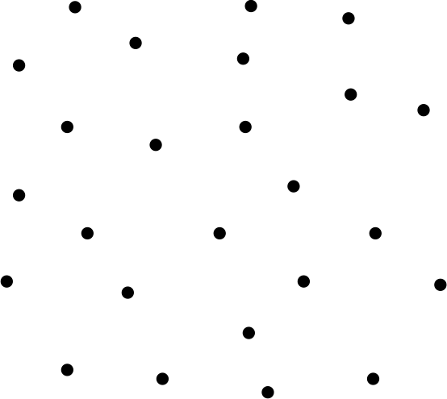
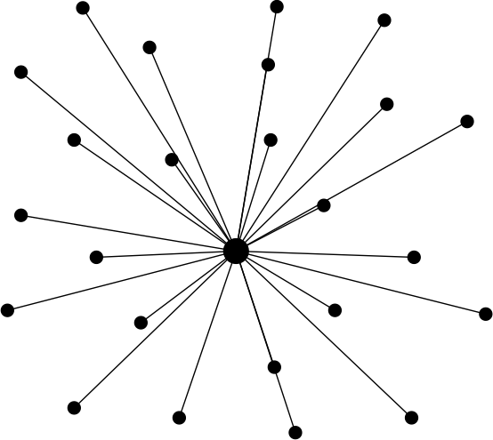
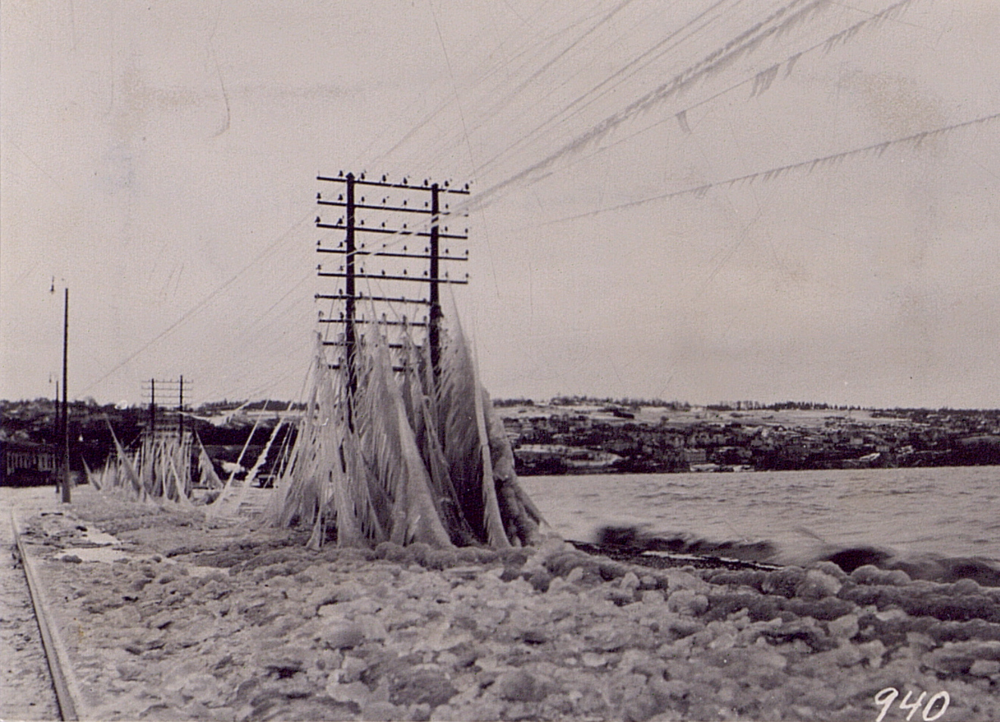
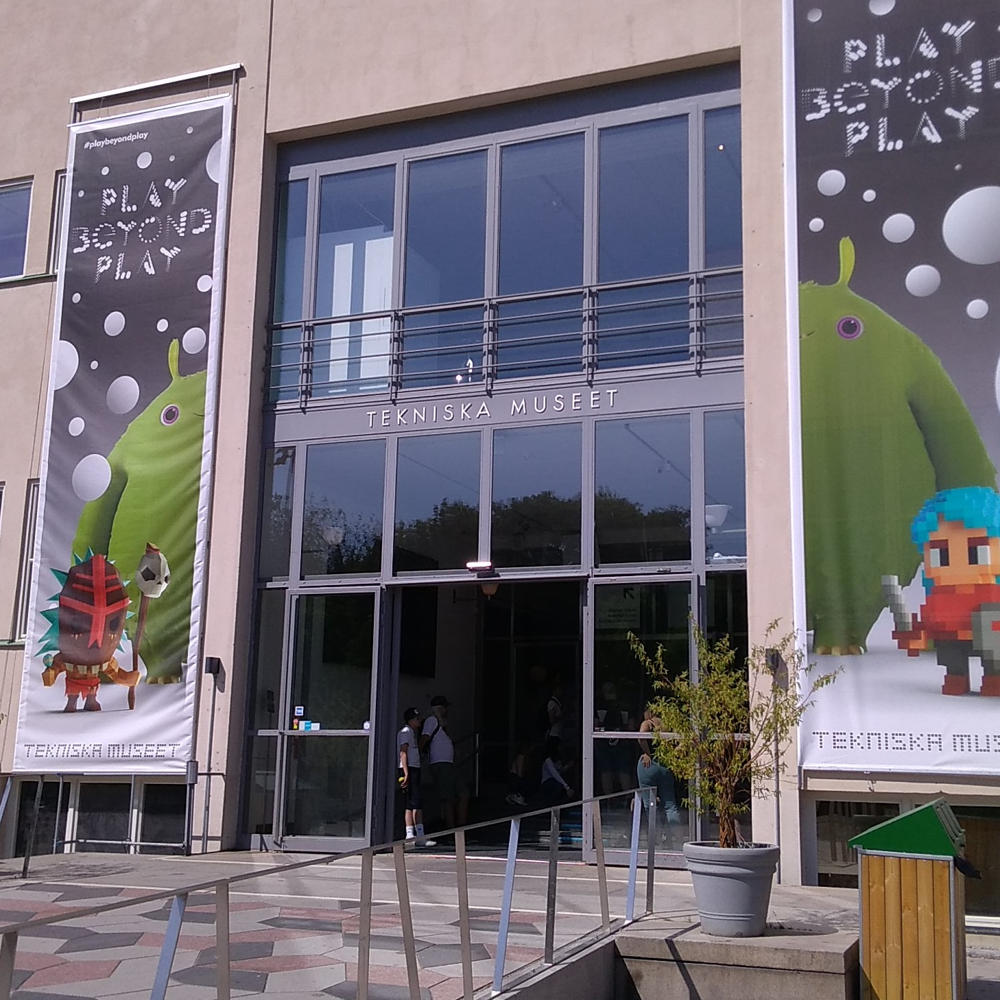
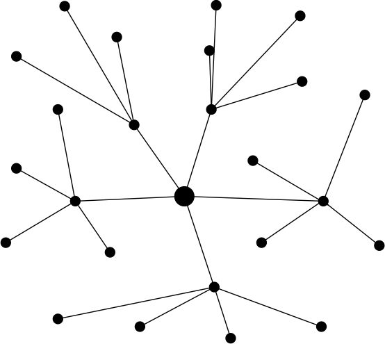

theme: Zurich
footer: Kenji Rikitake / oueees 20260623 topic02
slidenumbers: true
autoscale: true

# oueees-202606 topic 02

* Latency and laws of physics
* Centralized Communication
* Multiplexing

<!-- Use Deckset 2.0, 16:9 aspect ratio -->

^ 大阪大学基礎工学部 電気工学特別講義 2026年6月23日分 トピック01 遅延と物理法則、集中的コミュニケーション、そして多重化についての話を始めます。

---

# Kenji Rikitake

24-JUN-2026
School of Engineering Science, The University of Osaka
On the internet
@jj1bdx

Copyright ©2018-2026 Kenji Rikitake.
This work is licensed under a [Creative Commons Attribution 4.0 International License](https://creativecommons.org/licenses/by/4.0/).

^ 講師の力武 健次といいます。よろしくお願いします。

---

# CAUTION

The University of Osaka School of Engineering Science prohibits copying/redistribution of the lecture series video/audio files used in this lecture series.

大阪大学基礎工学部からの要請により、本講義で使用するビデオ/音声ファイルの複製や再配布は禁止されています。

^ 大阪大学基礎工学部からの要請により、本講義で使用するビデオ/音声ファイルの複製や再
配布は禁止されています。ご注意ください。

---

# Lecture notes and reporting

* <https://github.com/jj1bdx/oueees-202606-public/>
* Check out the README.md file and the issues!
* Keyword at the end of the talk
* URL for submitting the report at the end of the talk

^ レクチャーノートはGitHubのこのURLに掲載しています。

---

# Latency and laws of physics

^ 情報伝送を考えるにあたり、遅延は重要な要素になります。今回はまず遅延と物理法則という話から始めます。

* Speed of light in vacuum $$c$$
* 299 792 458 [m/s]
* This is a definition, *not* a measured value

^ 真空中の光の速度は、毎秒299,792,458メートル、約30万キロメートルです。2019年にこの値は、国際単位系SIの定義として採用されました。実測による推定ではなく、定義されている値です。なので、変わることは想定されていません。

---

# Refractive indices of materials

* $$v$$: speed of light in a material
* Refractive index $$n = c / v$$, always $$n \geq 1$$!
* Air: 1.000279 for λ=0.50 µm [^1]: 299709 km/s
* Water: 1.3330 for λ=589.3 nm [^1]: 224901 km/s
* Silica glass for λ=589.3 nm: 1.4585 [^1]: 206753 km/s

[^1]: 「光学的性質」, 理科年表2026, 丸善, ISBN: 978-4-621-31182-0, p. 469

^ 物質中の光の速度は、屈折率で割った分遅くなります。屈折率は常に1以上です。空気はほとんど遅くならないんですが、水の中や光ファイバーの中だとかなり遅くなります。この速度の差を問題視する人達もいて、株式市場に関する通信応用の世界では、他人の敷地内を突っ切って光ファイバーをひたすら最短距離で引くとか、光ファイバーをやめて電離層を介した短波通信をするとか、いろいろな試みが行われています。マイクロ秒の伝搬遅延が問題になるからだそうです。

---

# Distance latency and timing

* Osaka to Tokyo: ~400km = ~1.3ms (in vacuum/air)
* Tokyo, Japan to San Francisco, CA, USA: ~8300km ~= 28ms (in vacuum/air), 41ms (in silica glass)
* Japan <-> USA in optic fiber, round trip: ~100ms or more
* *Synchronization is hard*
* A question: can you play a network real-time game in the global scale, e.g., between Tokyo, New York, and Paris?

^ 実際に遅延時間について考えてみましょう。大阪から東京までは空気中だと400キロメートル、つまり1.3ミリ秒ぐらいかかります。東京−サンフランシスコ間は8300キロメートル、つまり空気中だと28ミリ秒、石英ガラスだと41ミリ秒かかるわけです。これにより日本と米国の間は往復で100ミリ秒以上かかることが推定できます。100ミリ秒は人間が十分知覚できる時間差ですから、大陸間で同期して物事を行うというのは想像以上に難しいのです。リアルタイムなネットワークゲームを東京、ニューヨーク、パリの間でやろうとしたらどうなるかを考えてみてください。

---

# Light traveling time and distance

wiring and wavelength matter

* ~300km in 1ms aka 1kHz
* ~300m in 1µs aka 1MHz
* ~30cm in 1ns aka 1GHz
* ~3mm in 1ps aka 1THz

^ 光の伝搬時間と距離、そして電線の長さと波長について考えてみます。1キロヘルツの波長は300キロメートル、1メガヘルツの波長は300メートルですが、1ギガヘルツになると30センチ、1テラヘルツになると3ミリになってしまいます。最近はスマホでも数ギガヘルツの周波数を扱うのは一般的で、より高度な5Gや6Gになると100ギガヘルツを越える周波数、つまり波長1センチメートル未満の世界に突入することになります。この世界では部品の物理的大きさが性能に影響するため、電子回路を組むのが困難になってきます。

---

# Centralized communication

^ 次に集中型コミュニケーションについて話します。

---

# Communication: sharing a medium

* Sharing a physical link between two or multiple parties
* *The physical layer*
* A medium could be: electric wires, optic fibers, radio airwaves, sound, flying birds like pigeons

^ そもそもコミュニケーションとは何かという話ですが、2つあるいはより多数の関係者で同じ物理的な接続、あるいは物理層を共有あるいはシェアしないとコミュニケーションはできません。この接続を実現する媒体としては、電線、光ファイバー、無線の電波、音、そして伝書鳩などの空を飛ぶ鳥などのいろいろな方式が考えられます。

---

# Connecting unconnected nodes

There are many ways to connect the dots in this picture

^ この図で点として示している、ネットワーク上の各ノード、つまり通信主体を接続する方法について考えてみます。いろいろな繋ぎ方があり得ます。

---

# Simplest way: star/centralized connection

- Centralized connection was the easiest way to connect the nodes
- Very much susceptible to network link failures
- Links should stay connected during the connection

^ 最も単純なやり方の一つとして、スター型、あるいは集中型の接続があります。これは最も容易なやり方でもあるんですが、中心への接続が切れると全体への接続が切れてしまうので、接続あるいはリンクの障害に対してとても弱いですね。また、通信中はリンクの接続を維持しておく必要があります。

---

# The old Stockholm telephone tower in 1890

` `

^ これは1890年にスウェーデンのストックホルムで実際に使われていた電話線のための塔の写真です。この塔から各地に向けて電線を張り巡らせていたのですね。なかなか壮観です。現代で同じことをやるなら地下に埋めると思いますが。

---

# Fallen telephone lines by frost at Jönköping, Sweden, 1929

` `

^ この電話線に起こった障害の例として、1929年に同じスウェーデンのヨンショーピングで起こった電話線の氷結による切断の例があります。見事に全部切れてますね。寒い地方では氷あるいは雪による架線の切断の可能性を考えないといけないわけです。他にも山火事や動植物による断線あるいはショートを考えないといけません。今なら無線、あるいは電線よりももっと軽い光ファイバーを使うかもしれません。

---

# Tekniska museet in Stockholm (June 2018)

` `

^ 余談ですが、私は2018年と2019年に、ストックホルムの技術博物館に行ってきました。日本には最近こういった博物館が減ってしまったのですが、技術の歴史とその社会的影響について知ることのできるとても良い場所です。

---

# Multiplexing

Sharing the same link by multiple nodes and communication devices

^ 次は、多重化という話をします。多重化とは、一つのリンクあるいは接続を、複数のノードや通信デバイスで共有するための技術です。

---

# Multiplexing enables decentralization

- Some links carry shared traffics for many different nodes

^ 多重化が可能になると、全部を一つの中心に対してつなぐ必要がなくなります。この図では中心のノードは5つの別のノードにつながっていて、それらのノードがさらに末端のノードへの接続を提供しています。

---

# How to multiplex different types of information, and put them together for sharing a same medium?

^ 具体的にどのような方法で、異なる種類の情報を多重化し、同じ媒体の上で配送するかについて考えてみましょう。

---

# Signal characteristics used for multiplexing

* Space division (multiple lines or multiple beam-formed antennas)
* Time division
* Frequency/wavelength division
* Polarization division
* Code division (multiple codes of very small cross-correlation)

^ 実際にはいろいろなやり方があり得ます。空間分割、つまり電線そのものを分けたり指向性を持たせたアンテナを使う方法、それから時分割、つまり通信の時間を分けて重ならないようにする方法、そして周波数あるいは波長の分割、光通信なら色を分ける方法、また電波や光であれば偏波面を分けることによる多重化、そして相互相関の非常に少ない符号列を使うことによる符号分割化という方法があります。次のトピックで話すパケット交換もこの多重化の方法の一つです。今回のトピックの話はこれで終わります。この後にキーワードがあります。

---

# Photo and image credits

* All photos and images are modified and edited by Kenji Rikitake
* Photos are from Unsplash.com unless otherwise noted
* Stockholm telephone tower: [Tekniska museet](https://www.flickr.com/photos/tekniskamuseet/6838150900/in/album-72157629589461917/), from Flickr, CC BY 2.0
* Jönköping telephone lines: [Tekniska museet](https://www.flickr.com/photos/tekniskamuseet/6978810049/in/album-72157629575713829/), from Flickr, CC BY 2.0
* Tekniska museet photo: Kenji Rikitake, CC BY 4.0

<!-- Photo and image credits here -->

<!--
Local Variables:
mode: markdown
coding: utf-8
End:
-->
