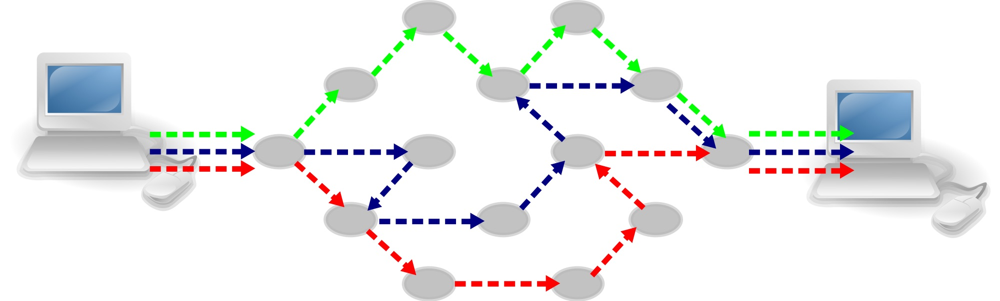
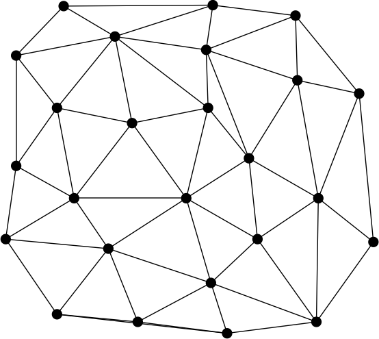
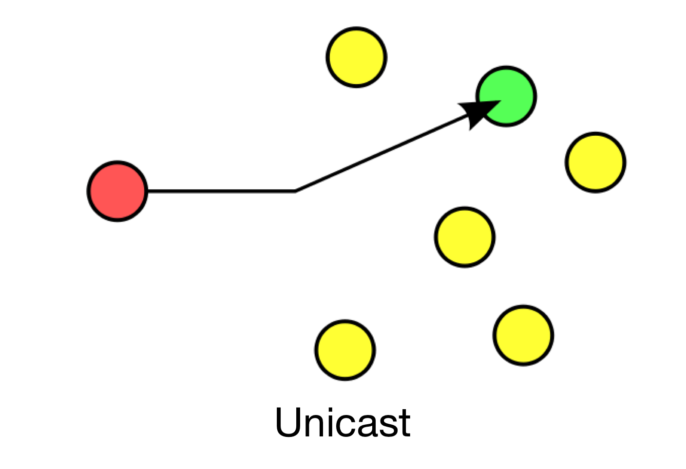
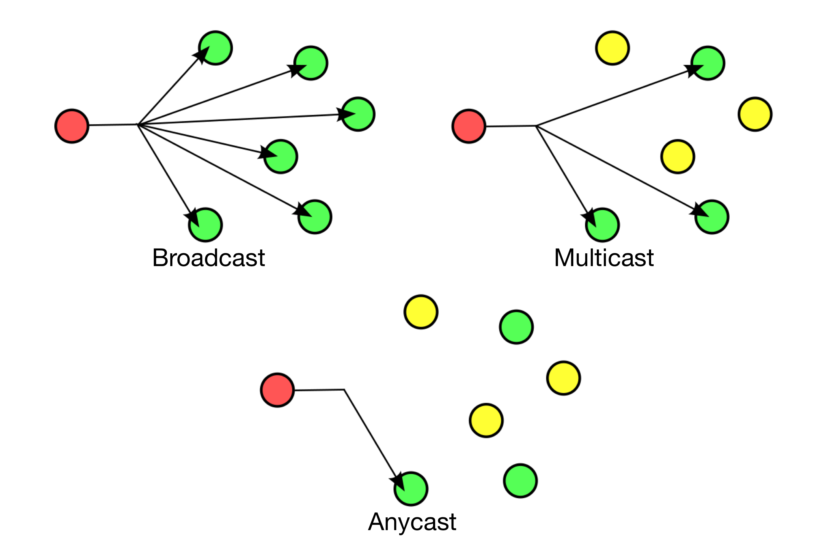

theme: Zurich
footer: Kenji Rikitake / oueees 20260623 topic03
slidenumbers: true
autoscale: true

# oueees-202606 topic 03

- Packet switching
- Routing basics

<!-- Use Deckset 2.0, 16:9 aspect ratio -->

^ 大阪大学基礎工学部 電気工学特別講義 2026年6月23日分 トピック03 パケット交換と基本的な経路制御に関する話を始めます。


---

# Kenji Rikitake

23-JUN-2026
School of Engineering Science, The University of Osaka
On the internet
@jj1bdx

Copyright ©2018-2026 Kenji Rikitake.
This work is licensed under a [Creative Commons Attribution 4.0 International License](https://creativecommons.org/licenses/by/4.0/).

^ 講師の力武 健次といいます。よろしくお願いします。

---

# CAUTION

The University of Osaka School of Engineering Science prohibits copying/redistribution of the lecture series video/audio files used in this lecture series.

大阪大学基礎工学部からの要請により、本講義で使用するビデオ/音声ファイルの複製や再配布は禁止されています。

^ 大阪大学基礎工学部からの要請により、本講義で使用するビデオ/音声ファイルの複製や再配布は禁止されています。ご注意ください。

---

# Lecture notes and reporting

* <https://github.com/jj1bdx/oueees-202606-public/>
* Check out the README.md file and the issues!
* Keyword at the end of the talk
* URL for submitting the report at the end of the talk

^ レクチャーノートはGitHubのこのURLに掲載しています。

---

# Packet Switching

What if you can split a stream into the *packets* and let them be delivered through *different links* for each packet?

^ 今回はパケット交換の話から始めます。ここまでの講義では、コミュニケーションの間ずっと同じリンクを共有してつないでおく、というやり方を仮定してきました。しかし、もしリンクの中の情報をパケットという単位に分割できて、それぞれのパケットについて別のリンクを使って通信できる、ということが可能だとすれば、通信の柔軟性や耐障害性をより高めることができます。これがパケット交換と呼ばれる技術の基本的な考え方です。

---

# How to form a packet (1/2)

* Split a stream into multiple pieces of data (payloads)

```
ABCDEFHIJ -> ABC DEF HIJ
```

* Put a header on each piece

```
ABC DEF HIJ -> P1-ABC P2-DEF P3-HIJ
```

^ データの流れであるストリームからパケットを作るには、まずストリームを分割してパケットにします。この例では9文字のストリームを3文字ずつに分割しています。そして分割したパケットに、順番を示すヘッダーを前に付けます。ここでヘッダー以外の部分をペイロードといいます。

---

# How to form a packet (2/2)

* Add source and destination addresses to each packet

```
P1-ABC P2-DEF P3-HIJ
 ->  FromXtoY-P1-ABC
     FromXtoY-P2-DEF
     FromXtoY-P3-HIJ
```

* Then send them on the network!

^ ここではXからYの通信としてこれらのパケットを使うものとします。そうすると、それぞれのパケットに、発信元X、受信先Yの情報を含んだヘッダーを付ける必要があります。ここまで付けたらネットワークに送信できる状態になります。

---

<!-- animated gif -->
[.background-color: #FFFFFF]


^ このアニメーションでは、3つのパケットが、緑、青、赤の順番に並んでいるものとします。パケットは通信の当事者であるホストから中継機能を持つノードに送られて、そこからそれぞれ別のノード間の経路を通ります。そして到達する順番も送る順番とは変わっています。

---

# Packet switching and the nodes

* Each communication node must know how to assemble/disassemble information to/from the packets
* Each communication node must know which link should be used to send a packet for the given destination
* Packets can be lost; relaying nodes cannot detect a lost packet

^ パケット交換での中継ノードは、いくつかの条件を満たす必要があります。まず各ノードは各種のヘッダーを認識して処理できないといけません。また、到達先に送るには自分のノードのどのリンクを使えば良いかを知らないといけません。パケットは途中のリンクの状態が悪いと失われる可能性があり、失われたかどうかについては各中継ノードは知ることができません。

---

# Packet (dis)assembly issues

* The sequence of delivered packets may differ from that of the sender intents; holding the out-of-sequence packets are required
* Retransmission is required to recover a lost packet for a reliable communication

^ 送られてきたパケットの順番は、必ずしも送った側の意図を反映していない場合があります。つまり入れ替わることがあります。順番通りでないパケットが到着した場合は、欠けているバケットが揃うまで受信側でその内容を保持しないといけません。とはいえ順番の問題が解決しない間は通信が進まないので、信頼性のある通信を行うには、失われたパケットについて受信側から再送要求を行ったり、送信側が再送して内容を回復させる必要があります。

---

[.background-color: #FFFFFF]


^ これは典型的なパケット交換ネットワークの図ですが、ここでは何段のノードを通過するかというホップ数がパケットによって違っているのがわかります。緑と赤は6段ですが、青は7段です。実際のパケット交換ネットワークの運用では、各種条件によってパケットのホップ数や経路は刻々と変わっていきます。

---

# Packet switching enables

* Changing the packet relay routes *during* the communication
* Using multiple routes for a single communication link
* Aggregating multiple communication links into a physical link
* Connectionless *and* connection-oriented communication simultaneously

^ パケット交換の利点について考えてみます。通信を行っている間に中継経路を変えることができるので、一つの経路に障害が発生しても、別の経路を選んで通信を継続することができます。また一つの通信について複数の経路を使えるので、同時に使って伝送量を上げることもできます。そして複数の通信ストリームを一本の物理的なリンクにまとめて通信することもできます。さらに、一つのパケットだけで通信内容が表せる場合は、通信路を確立させて行うコネクションオリエンティッドな方式と同時に、確立させずに済むコネクションレスな方式を使うこともできます。

---



# Truly distributed networks are feasible by packet switching

* No centralized nodes
* Each link can be utilized by all nodes
* A disconnection of the link will not be fatal so long as one link is connected to a node

^ パケット交換を応用すると、分散したネットワークを組むことができます。ここでいう分散とは、中心のノードがないこと、それぞれのリンクをすべてのノードが活用できること、つまり外界に対して一本のリンクが使える状態であれば他の各ノードとの通信が維持できることを指します。

---

# Disadvantages of packet switching

* Each node must be able to form/generate and decode/interpret a packet
* Forming and decoding a packet takes time and the computing resources
* Reliability and latency can be a trade-off
* Relay nodes can be neutralized by denial-of-service attacks
* Difficult to manage

^ とはいえパケット交換も良いことばかりではありません。それぞれのノードはパケットのヘッダーや場合によってはペイロードの解釈をしないといけないので、そのための計算量と計算資源を必要としますし、時間もかかります。故に信頼性と遅延がトレードオフの関係になってしまいます。また、中継ノードはサービス拒否あるいはDoS攻撃と言われる無関係あるいは無意味な情報の大量受信で使えなくなってしまうこともあります。昨今のサイバー攻撃の典型的なやり方の一つです。そして、通信の機能が多数のノードに分散して配置されるため、管理がとても難しくなります。

---

# [fit] Routing basics

^ ここからはパケットをどのようにノード間を接続するリンクに振り分けるかという経路制御の基本の話をします。

---

# Various aspects of routing

* Delivery
* Addresses
* Static or dynamic
* Route aggregation
* Security

^ 経路制御にはいろんな側面があります。どのように伝えるか、場所と相手を示すアドレスをどう解釈するか、そもそも経路が固定されているのか変わるのかなどの要素を考えないといけません。またネットワーク運用の上では、複数の経路をまとめて処理する経路集約や、経路制御に関する不正が行われないようにするセキュリティの問題も考える必要があります。

---

# Delivery schemes

* Unicast
* Broadcast/Multicast/Anycast

^ 情報の伝え方について考えてみましょう。最も一般的なのは1対1で通信を行うユニキャストです。しかし実際には複数の相手に対して一斉送信するブロードキャストやマルチキャスト、そして特定の属性を持った相手のうちどれか一つが情報を受信すればよしとするエニーキャストなどの伝え方も使われています。

---
[.background-color: #FFFFFF]



^ ユニキャストでは、一つだけ相手を選んで伝えます。この方法では複数の相手に同じ内容を伝えようとすると、相手の数だけ別途ユニキャストを繰り返さないといけないという欠点があります。

---
[.background-color: #FFFFFF]



^ ブロードキャストではつながっているネットワーク全体に一斉送信します。この一斉送信の中で特定の属性を持った複数の相手だけに伝えるのをマルチキャストといいます。ネットワーク運用では中継ノードの意味を示すルータへのマルチキャストがよく使われます。マルチキャストを接続ノードやホスト全てに対して行うとブロードキャストになります。一方、複数の相手に対して送信して、どれか一つが受信してくれれば良いという通信もあり、これをエニーキャストといいます。ドメイン名とIPアドレスを結びつけるドメイン名システムでは、複数のサーバーのうちどれかが返事すれば通信が成立するため、エニーキャストが使われます。今回のトピックの話はこれで終わります。この後にキーワードがあります。

---

# Photo and image credits

* All photos and images are modified and edited by Kenji Rikitake
* Packet Switching animated GIF: [By Oddbodz from Wikimedia Commons](https://upload.wikimedia.org/wikipedia/commons/f/f6/Packet_Switching.gif), CC BY-SA 3.0
* Internet packet switching: [By Computer-blue.svg: OpenClipartderivative work: Pluke (Computer-blue.svg)](https://upload.wikimedia.org/wikipedia/commons/c/c0/CPT-internet-packetswitching.svg), via Wikimedia Commons, CC0 (Public Domain)
* Unicast/broadcast/multicast/anycast diagrams: [By Easyas12c~commonswiki / Perhelion](https://en.wikipedia.org/wiki/Routing#/media/File:Cast.svg), via Wikimedia Commons, CC0 (Public Domain)


<!--
Local Variables:
mode: markdown
coding: utf-8
End:
-->
