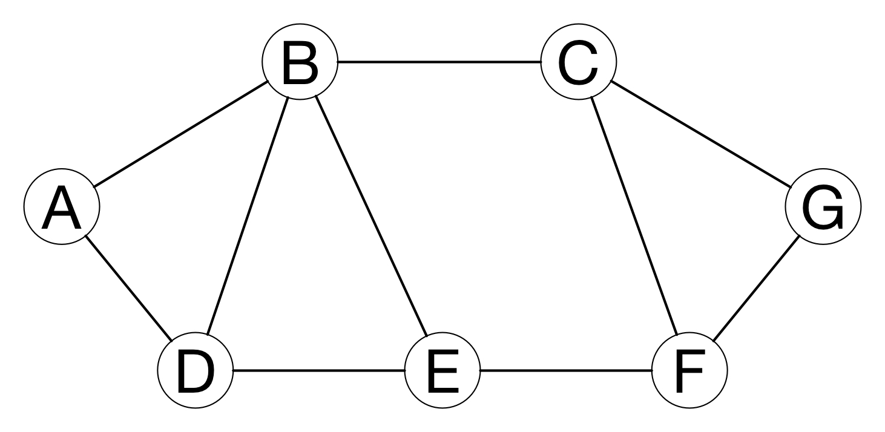
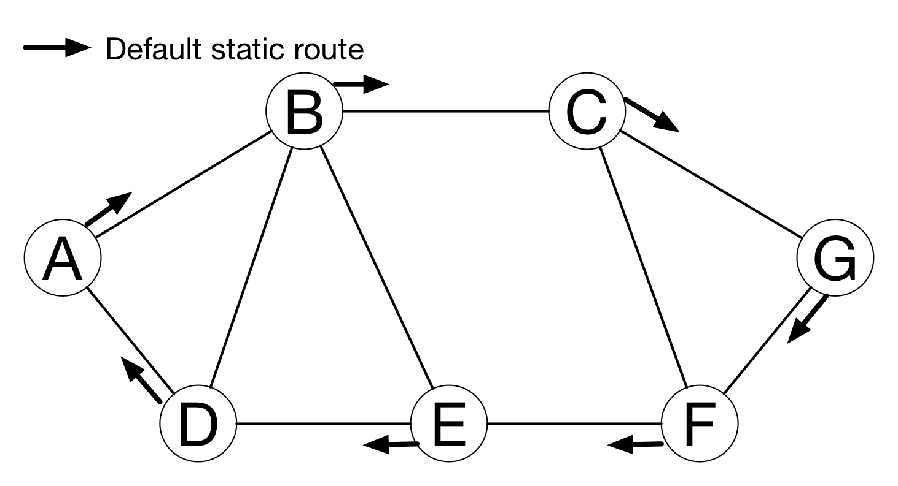
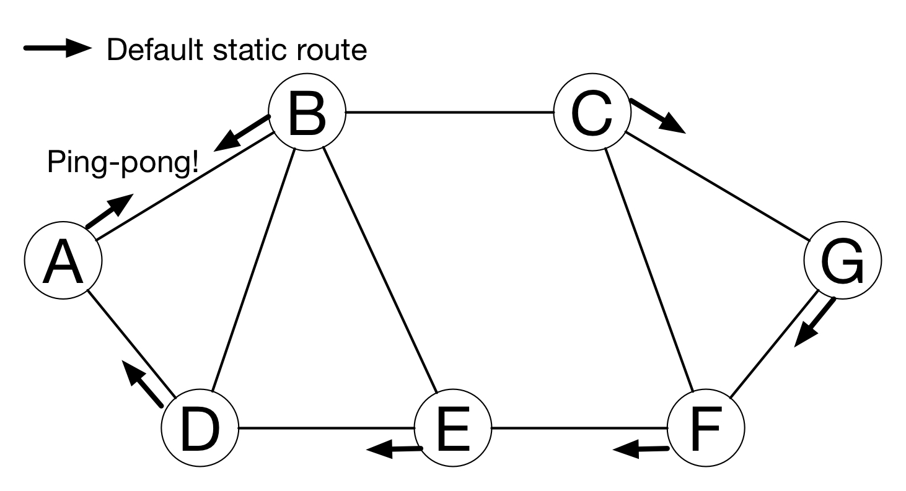
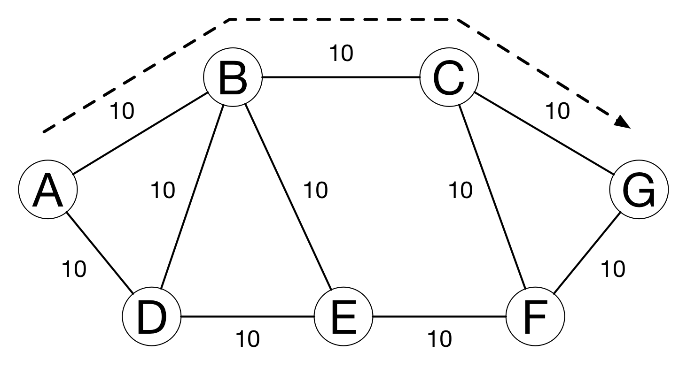
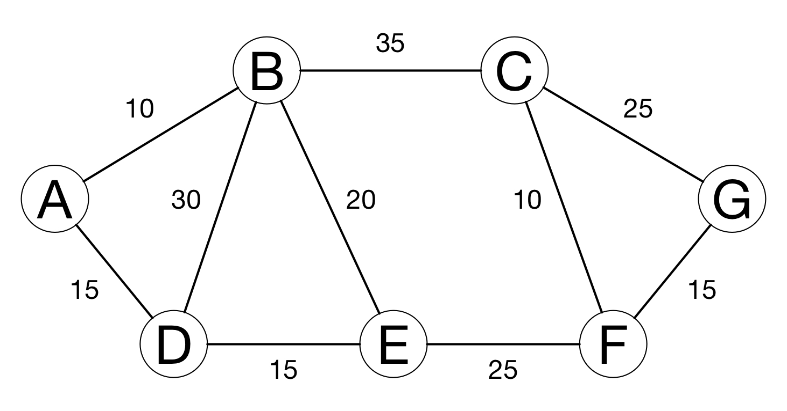
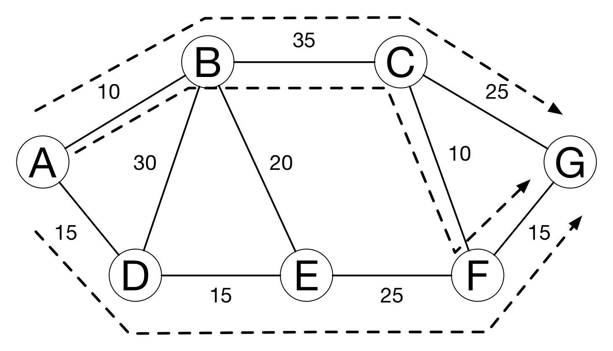
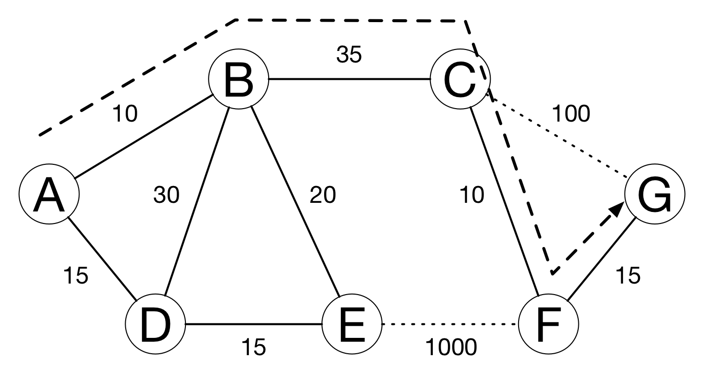
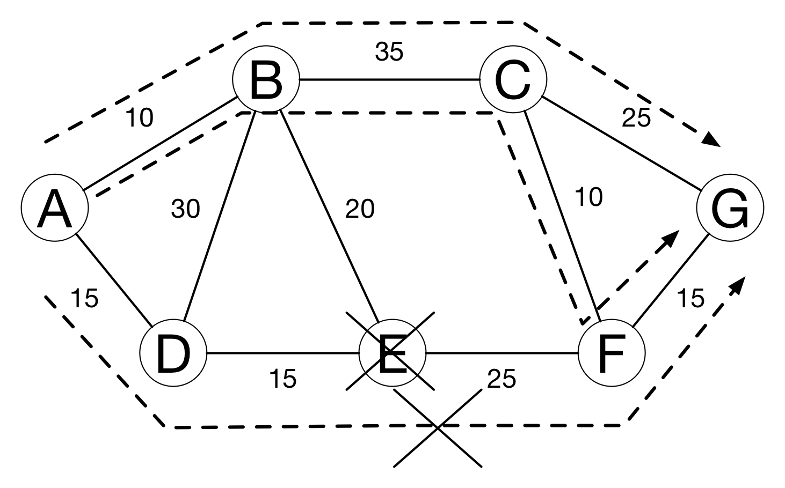
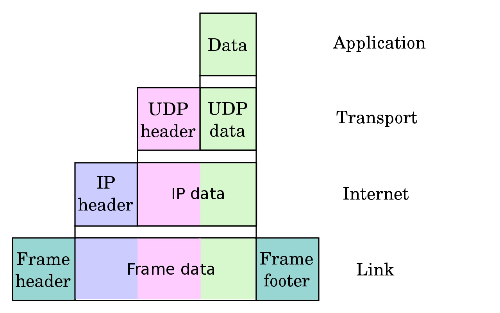
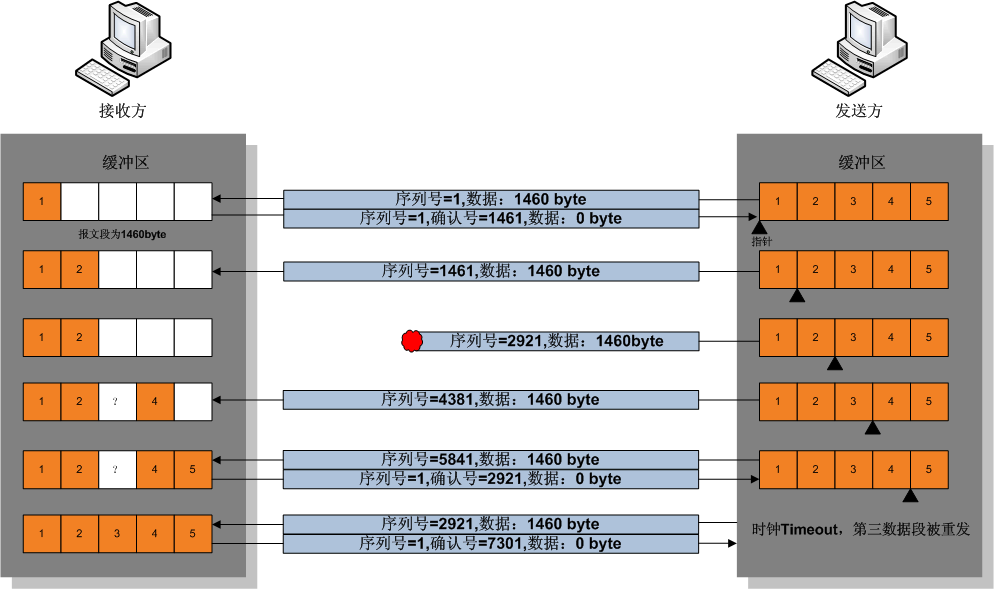

theme: Zurich
footer: Kenji Rikitake / oueees 20260623 topic04
slidenumbers: true
autoscale: true

# oueees-202606 topic 04:

- Internet Protocol (IP) addresses
- Routing in details
- Network transports

<!-- Use Deckset 2.0, 16:9 aspect ratio -->

^ 大阪大学基礎工学部 電気工学特別講義 2026年6月23日分 トピック03 経路制御の詳細とネットワークトランスポートに関する話を始めます。

---

# Kenji Rikitake

23-JUN-2026
School of Engineering Science, The University of Osaka
On the internet
@jj1bdx

Copyright ©2018-2026 Kenji Rikitake.
This work is licensed under a [Creative Commons Attribution 4.0 International License](https://creativecommons.org/licenses/by/4.0/).

^ 講師の力武 健次といいます。よろしくお願いします。

---

# CAUTION

The University of Osaka School of Engineering Science prohibits copying/redistribution of the lecture series video/audio files used in this lecture series.

大阪大学基礎工学部からの要請により、本講義で使用するビデオ/音声ファイルの複製や再配布は禁止されています。

^ 大阪大学基礎工学部からの要請により、本講義で使用するビデオ/音声ファイルの複製や再配布は禁止されています。ご注意ください。

---

# Lecture notes and reporting

* <https://github.com/jj1bdx/oueees-202606-public/>
* Check out the README.md file and the issues!
* Keyword at the end of the talk
* URL for submitting the report at the end of the talk

^ レクチャーノートはGitHubのこのURLに掲載しています。

---

# Internet Protocol (IP) addresses

^ 経路制御に関する細かい話の一つとして、IPアドレスの話をします。IPアドレスとは、インターネットにつながる各システムに一意に割り当てられる識別子のことです。ドメイン名とは違い、固定長の整数で表現されます。IPとはインターネットプロトコルの意味です。

---

# Role of IP addresses

* Network numbers
* Interfaces: connected to the networks
* Host IDs in the numbered networks
* Global uniqueness
* Special addresses (private, broadcast, multicast, loopback, etc.)

^ IPアドレスの役割としては、ネットワークの番号、それから各ノードがどのネットワークにつながっているかを示すインターフェースの番号、ネットワークの中でのホストとしての番号を示すという重層的な意味があります。一般的にはIPアドレスは世界で一つのグローバルな一意性を持ちますが、実際には直接世界にはつながらないプライベートネットワークや、マルチキャストやブロードキャストの相手を示すアドレス、そして機器自身を示すループバックアドレスなど特別な役割を持つものもあります。

---

# IPv4 addresses: 32 bits

- 192.168.100.20
- In hexadecimal notation: 0xC0A86414
- 4 x 0~255 numbers split with dots
- Relatively easy to remember, but already being used up

^ IPアドレスとして昔から使われているのは32ビットのIPバージョン4あるいはIPv4のアドレスです。これは32ビットの整数を8ビット毎に0から255の数で表現してドットで区切ったものです。16進数で書くとC0A86414となります。一般的なIPアドレスというとこちらを指しますが、32ビットつまり2の32乗あるいは43億個弱しか区別できないんですね。すでに世界の人口は2024年には82億に達していますから、もはやこれではまったく足らない状態になっています。

<!-- https://population.un.org/wpp/assets/Files/WPP2024_Summary-of-Results.pdf -->

---

# IPv4 address with netmask

- 192.168.100.20/24
- Network: 192.168.100.0/24
- Host: number 20 (0~255) (32-24=8)
- Host 0 = network itself
- Host 255 = broadcast

^ 192.168.100.0というIPアドレスについて考えてみます。このIPアドレスはどういう意味を持っているかというと、上位ビットからネットワークを示すビット長（ネットマスクともいいます）を決めて、残りをそのネットワークの中のホスト識別に使うことになっています。ここで示す192.168.100.0/24というアドレスは、ホスト識別部がゼロなので、ネットワーク自身を示します。たまたまドット区切りとネットワークの区切りがいっしょですね。なおホスト識別部のビットが全部1だと、ブロードキャストアドレスを示します。

---

# Address in another netmask

- 192.168.100.20/28
- Network: 192.168.100.16/28
- Host: number 4 (0~15) (32-28=4)
- Host 0 = network itself
- Host 15 = broadcast
- Different netmask = different address interpretation

^ 似たようなアドレスですが意味の違う例を示します。この例ではドット区切りとネットワークの区切りがいっしょではありません。ネットワーク部は28ビットありますので、ホスト識別部は4ビットしかありません。また、ネットマスクが違うので、前のスライドの192.168.100.0/24とはまったく違う、特に含むホスト数の違うネットワークとして認識する必要があります。

---

# Private addresses (RFC 1918)

No global routing for these address blocks:

- 10.0.0.0/8
- 172.16.0.0/12 (172.{16~31}.\*.\*)
- 192.168.0.0/16 (192.168.\*.\*)

^ プライベートアドレスという話をします。現在IPv4インターネットに接続されているホストの大部分はこのプライベートアドレスを使っています。プライベートアドレスには、ネットワークを外部から切り離すこと、そしてその結果としてグローバルな到達性を持ったアドレスの消費を抑える、という2つの役割があります。切り離したネットワークをインターネットに接続するにはアドレス変換(NAT)という技術を使いますが、この講義では詳細は割愛します。

---

# Other special addresses (RFC 6890)

- 0.0.0.0/8: "This" network
- 100.64.0.0/10: Shared address
- 127.0.0.0/8: Loopback
- 169.254.0.0/16: Link local
- 192.0.0.0/24: IANA specific
- 192.0.2.0/24, 198.51.100.0/24, 203.0.113.0/24: Documentation
- 192.88.99.0/24: 6to4 Relay Anycast
- 198.18.0.0/15: Benchmarking
- 240.0.0.0/4: Reserved
- 255.255.255.255/32: Limited broadcast

^ その他にもいろいろな役割を持ったアドレスがあります。これらの役割については詳細を記した文書があります。一例として、文書に書く場合は特定の組織などを代表しないように、文書で例示するため専用のアドレス空間があります。実際に使われている電話番号を説明用のマニュアルに書いたら個人情報の漏洩になりかねないですよね。

---

# IPv6 addresses: 128 bits

* 2a03:2880:f24e:e0:face:b00c::4420
* 2a03:2880:f24e:00e0:face:b00c:0000:4420
* a www.instagram.com address, as of 17-JUN-2026 0318UTC
* :xxxx: = up to 4 hex digits
* :: = arbitrary number of 0, appearing only once in an address
* Your lookup results may vary

^ IPv4アドレスではアドレスが不足してしまうため、最近のインターネットではIPバージョン6あるいはIPv6アドレスも使われています。これは128ビット固定長の整数で、16進数4桁ごとにコロンで区切って表します。0が続く部分は一度だけコロン2つで省略できるようになっています。例示したのは最近確認したwww.instagram.comのアドレスです。昨年まではGoogleのアドレスだったんですが、今年はGoogleのIPv6アドレスは様変りしていました。興味ある人は自分で調べてみてください。

---

# IPv6 addresses with netmask

* 2a03:2880:f24e:e0:face:b00c::4420/64
* Network: 2a03:2880:f24e:e0::/64
* Host number: 0xfaceb00c00004420
* Host number: 64 bits (0: network)
* Broadcast -> multicast addresses
* ff02::1 = all hosts, ff02::2 = all routers, etc.

^ このアドレスですが、慣例としてネットマスクは64ビットとして使われています。これだけあればアドレスの不足は当分ないだろうと考えられています。ネットワーク自身はIPv4と同様ホスト識別部あるいは下位64ビットが0で表現されますが、IPv4で使われていたブロードキャストアドレスはIPv6ではマルチキャスト専用のネットワーク識別子を使うように変わりました。

---

# Why IPv4 to IPv6?

- Because we've used up the 32-bit IPv4 addresses already
- No more new address block for IPv4
- You need to buy unused blocks from other users
- Took ~20 years (1996-2016) for the transition from IPv4 to IPv6
- IPv6 has less users and nodes; plausibly less congested

^ なぜIPv4とIPv6が並立しているかについて説明します。IPv4のアドレスはもう新規に割り当てる場所がなく、使わなくなったアドレスは市場で高値で取り引きされている状況です。ですので、大規模な新規ネットワークアプリケーションはIPv6アドレスを使うことが増えました。IPv6が提案されてから移行普及に実質20年かかっていますが、未だにIPv4アドレスを前提としたサービスも多数残っており、IPv6の規模そのものはIPv4に比べて小さな状況が続いています。

---

# Routing in details

^ ここからは経路制御のやり方に関する細かい話をします。

---

<!-- talk contents here -->
[.background-color: #FFFFFF]



^ 図のような7つのノードが接続されたネットワークを考えます。

---

# Static routing

- Set the default route for nodes which are not directly reachable
- Works well on simple networks or star networks
- Static routing may cause *ping-pong*

^ 静的経路制御あるいはスタティックルーティングで経路を決めることを考えます。具体的な方法としては、直接接続されていないネットワークに対して送信するときは、既定値あるいはデフォルトの経路を固定して決めて送信します。

---
[.background-color: #FFFFFF]



^ この図ではデフォルト経路は右回り隣のノードに送信しています。このやり方は簡単なネットワーク、特にスター型ではうまく機能しますが、場合によってはパケットがピンポンして無限ループを起こしてしまうことがあります。

---
[.background-color: #FFFFFF]



^ この図ではBが左回りにデフォルト経路を設定しているため、AがGにパケットを送信しようとすると、GはAにもBにもつながっていないため、それぞれのデフォルト経路でAからBへ、BからAへとパケットが無限ループしてしまいます。

---

# Dynamic routing

- Hop count: count the hops between nodes
- Link cost: determined by the speed and quality
- Administrative policies

^ スタティックな経路制御ではうまくいかない場合もあることがわかりました。そこで何らかの形で経路を決定するアルゴリズムを考えてみます。一般的なやり方としては、ノード間の中継数あるいはホップ数を数えたり、ノード間のリンクに対して速度や品質を反映したコストを設定して積算したりする方法があります。また、あらかじめ管理方針を決めて制限するというやり方もあります。このような動的な経路制御では、ネットワーク全域で経路情報を共有するというやり方をします。

---

# Simple hop counting

- Assume every link costs the same with each other

^ 単純にホップ数を数えるやり方を考えてみましょう。これはそれぞれのリンクのコストが同じ場合に、最小コストの経路を求めよという問題と同じ問題になります。

---

[.background-color: #FFFFFF]



^ 図の場合で考えてみると、AからGへの最小コスト経路は、A-B-C-Gでコストが30になります。A-D-E-F-Gは、コストが40で、次にコストの少ない経路となります。

---

# Evaluating link cost

- What if the cost of each link varies?
- If two or more paths have the equal cost, all of the links will be utilized for load balancing

^ ここでコストをどう設定あるいは評価するかについて考えてみます。それぞれのリンクのコストが違っていたら最適経路は変わります。また、2つ以上の経路が同じコストであれば、それらを同じように使うことで、各ノードの負荷を抑えることもできます。

---
[.background-color: #FFFFFF]



^ この図ではそれぞれの経路のリンクのコストを変えてあります。

---
[.background-color: #FFFFFF]



^ コストを積算してみると、A-B-C-Gのコストは70, A-B-C-F-Gのコストも70、A-D-E-F-Gのコストも70となります。このコスト情報が7つのノードに行き渡っていれば、Aはこの3つの経路を同じコストとして判定して使い分けることができるようになります。

---

# Simulating link failures

- What if the link suddenly degrades or is disconnected?
- Largely increasing the cost of degraded or disconnected links will give an easy solution

^ リンクの速度やエラー率などの品質が悪化したり、切断して障害が発生した場合を考えてみます。これらの事象をリンクコストを使った経路制御に反映するには、該当するリンクのコストを大幅に上げるのが効果的な方法の一つです。

---
[.background-color: #FFFFFF]



^ この図ではC-Gの品質が悪化しリンクコストが100となり、E-Fで障害が発生したためリンクコストを1000としてみました。このような状況になると、最小リンクコストの経路は自動的にA-B-C-F-Gの70のみに定まるようになります。

---
# Administrative policies

* For many reasons, you don't want to accept packets from some nodes, depending on the relay paths
* For example: passing C is OK, but passing E is not: A-B-C-G and A-B-C-F-G are OK, but A-D-E-F-G is blocked
* Common among interconnection of the autonomous systems (internet service providers and organizations)

^ 同じ組織など管理方針が同じネットワークの中であればリンクコストの計算で経路制御ができますが、そうでない組織間の場合は、どの経路を通ってくるかを調べて通信を遮断したい場合があります。このような遮断要請は、接続事業者などの間で一般的に行われています。今までの図を例として、たとえばEを通過させたくないという方針を考えてみましょう。

---
[.background-color: #FFFFFF]



^ この図ではEが遮断されている状況を考えます。このような遮断を実現するためには、リンクコストの情報ではうまくいきません。どのノードを通るかを経路に記録した上で、Eを通るものを明示的に識別して遮断できるようにすることが必要です。

---

# Routing information dissemination protocols

* Link-state protocol: flooding link cost information of each node throughout the network
* Path vector protocol: exchanging path of nodes for each network instead of the link costs
* Highly vulnerable to external attacks

^ 経路情報のやり取りをするための手順あるいはプロトコルとしては、今まで説明してきたネットワーク全体にリンクコスト情報をどんどん広げていくリンクステートプロトコルというのがあります。また、経路遮断の例で説明した、リンクコストではなく使用する中継経路を列挙していくパスベクトルプロトコルもあります。経路情報プロトコルへの攻撃は、ネットワーク運用に対して大きな被害の原因になります。

---

# Routing aggregation

- The following four networks
  * 192.168.100.0/24
  * 192.168.101.0/24
  * 192.168.102.0/24
  * 192.168.103.0/24
- -> aggregated as 192.168.100.0/22
- 4 networks together as one aggregated network

^ 経路情報はインターネット全体を考えると莫大な量になります。そこで少しても経路情報の量を減らすために、ネットマスクを使って集約することが行われています。ここに示した例では、ネットマスクが/24の連続したアドレス空間を使っている4つのネットワークを、ネットマスクが/22の1つのネットワークとして集約しています。

---

# Limitation of IP address structure

---

# Network transports

^ ここからはネットワークトランスポートの話をします。トランスポートというのは、IPパケットの上で情報を効率良く運ぶためのプロトコルのことです。

---

# IP address and the port number

* Each service has a 16-bit port number
* HTTPS = 443, DNS = 53, SSH = 22, etc.
* A pair of IP address and port number defines an endpoint of communication

^ インターネットではポート番号というのがあって、それぞれのサービスやアプリケーションには16ビットのポート番号が割り当てられます。例としてHTTPSは443番、DNSは53番です。IPアドレスとポート番号の組で通信のそれぞれの端点あるいはエンドポイントを示すことができます。

---

# UDP and TCP

* Two major transport protocols on the internet
* User Datagram Protocol (UDP, RFC 768): connection-less
* Transmission Control Protocol (TCP, RFC 9293): connection-oriented
  - Obsoleted RFCs: 793, 879, 2873, 6093, 6429, 6528, 6691
* See <https://www.rfc-editor.org> for all the internet RFCs
* RFC: Request for Comment

^ 代表的なトランスポートプロトコルとして、UDPとTCPがあります。UDPはコネクションを行わないコネクションレスプロトコルで、TCPはコネクションを張って仮想的なストリーム通信路を作るプロトコルです。インターネットでRequest for Comment (RFC)という文書で標準化された規格を示すのですが、最近TCPは仕様の改訂が行われて番号が変わりました。

---

# Packet exchange limitation

* Packets are not always delivered
* Sending sequence is not preserved
* The same packet may be received multiple times
* The content of the packet may get altered or damaged
* Packet size has the limitation

^ パケット交換でできることの限界についておさらいしてみます。まずパケットは常に届くとは限りません。届く順番も送信した順番とは変わっている可能性があります。そして同じパケットが何度も受信されてしまう可能性もあります。パケットの中身は情報が書き変わっているかもしれません。またパケットにできる情報の大きさには限界があります。

---

# What UDP does

* Add a header with the port number
* Send it in an IP packet
* ... and that's it

^ UDPは何をしているのかについてですが、基本的にはポート番号のついたヘッダを加えて、それをIPパケットの中に入れて終わりという単純な構造になっています。

---



^ これはUDPパケットを図で示したものですが、IPヘッダで送受信アドレスを表現し、UDPヘッダでポート番号を示すだけといった構造を示しています。これによって、パケットはほぼそのままの姿でアプリケーションに届けられます。再送や順番の管理といったことはUDPの制御としては一切行われません。

---

# UDP's pros and cons

* UDP datagrams are still not always delivered and may get lost
* Sequence is not preserved
* The same datagram may be received multiple times and may cause duplicate delivery
* The errors in the contents of UDP datagrams are detectable
* UDP datagram has the size limit: suitable for relatively small messages
* Very small additional latency

^ UDPの欠点と利点について見てみましょう。まず到達は保証されないのでデータグラム（これはパケットとほぼ同義です）はなくなる可能性があります。また同じデータグラムが複数回届いてしまう可能性があります。ただしUDPデータグラムの配送で情報の改変が起こった場合は検知できます。データグラムの大きさには上限があります。プロトコルが簡単なので遅延は小さいです。なので、UDPの上に別のトランスポートプロトコルを作る用途にも使われます。

---

# Transmission control protocol (TCP)

* Detect packet loss by timeout
* Split stream into segments
* Put sequence numbers to the segments
* Reassemble segments to the stream
* Perform congestion control

^ 次はTCPについて見ていきます。TCPではパケットの到着時間に上限つまりタイムアウトを設けることで、到着しないことを検出し、再送を要求します。またストリームをセグメントに分割し、各々のセグメントにシーケンス番号をつけることで、受信したパケットから順番を揃えてストリームを再構築することができます。さらに再送のタイミングを変えることで、伝送路が込み合っている場合のさらなる輻輳を防ぐ仕組みが入っています。

---



^ この図はTCPによるストリーム伝送の様子です。右から左にパケットが送られていきます。最初に1460バイトのパケットが送られ、無事受信できたので1461バイト目からの情報要求が受信側から送られます。2番目のパケットからは同様に情報が特に毎回確認せずに送り続けられますが、3番目のパケットが到達していないため、3番目のパケット受信のタイムアウトが発生した時点で2921バイト目からの情報を再送して欲しいという要求が受信側から出ます。これに応じて送信側が3番目のパケットを再送した時点で受信側で7300バイト分の情報がすべて受信できたので、その旨受信側から送信側に確認パケットが送信されます。この受信側からのパケットが受信されて、やっと送信側は7301バイト目からの送信を続けることができます。このようにして通信の信頼性を確保しています。

---

# TCP's pros and cons

* Loss is detected and recovered so long as the connection is alive
* Sequence is preserved
* No content repetition
* Errors are detected and fixed by retransmission
* The stream will accept data so long as the connection is alive
* Data delivery may delay if retransmission occurs

^ TCPの利点と欠点について述べます。コネクションを張っている間は、情報が欠けたことが検出され再送により回復されることが保証されます。順番も保証されますし、同じ内容が重複することもありません。誤りが検出された場合も再送によって修復されます。コネクションが生きている間はストリームはデータを受けつけます。ただし再送やタイムアウトのせいで、データが伝わるのが遅れる可能性は常にあります。

---

# Web: HTTP/3: HTTP/2 over QUIC

* People wants *speed* and *smaller latency*
* HTTP/2 (RFC 7540): TCP-bound, stream aggregation and content compression
* QUIC (RFC 9000): UDP-based, tightly integrated to HTTP/2 and specific congestion control
* HTTP/2 had *head-of-line blocking problem* by TCP
* HTTP/3 (RFC 9114): HTTP/2 over QUIC (supported by most browsers already)

^ もともとWebの伝送プロトコルであるHTTPはTCPの上に作られましたが、より速く遅延の少ないプロトコルが求められました。そこでHTTP/2で複数のデータストリームをまとめて圧縮するようになりました。しかしHTTP/2では次のスライドで説明するHead-of-lineブロッキング問題があり、これを避けるためにHTTP/2と連携するトランスポートプロトコルQUICがUDPの上に作られました。そして今はこれらを統合したHTTP/3が普通に使われるようになっています。

---

# Buffering and head-of-line (HOL) blocking on HTTP/2 [^1]

* Buffering causes only the oldest packets to be forwarded
* HTTP/2 uses single stream TCP for multiple HTTP requests and responses
* If TCP has retransmission, all the request-response exchanges will be halted until the lost data is recovered
* QUIC solved this problem by multiplexing multiple HTTP exchanges over the UDP datagrams

[^1]: Wikipedia contributors, [Head-of-line blocking: In reliable byte streams](<https://en.wikipedia.org/w/index.php?title=Head-of-line_blocking&oldid=1216469719>), Wikipedia, The Free Encyclopedia, 31 March 2024, 05:41 UTC [accessed 9 June 2024]

^ Head-of-lineブロッキング問題について説明します。バッファを使った欠損データの回復を行おうとすると、欠損が発生した以降のデータは欠損が回復するまで転送されません。HTTP/2では一つのTCPストリームに複数のHTTPの処理要求と応答を乗せていたため、TCPで再送が発生すると、それが回復するまですべてのストリームが止まってしまうという問題がありました。これがHTTP/2上のhead-of-lineブロッキング問題です。QUICではこの問題をUDPデータグラムの上で複数のHTTPの通信を多重化することで解決しています。

---

# Transport for various network environments

* Local/Ethernet: short delay, low loss
* Mobile/WiFi: medium delay, high loss
* Longhaul/fiber: long delay, medium loss
* LEOs (Starlink): varying SNR, varying loss [^2]
* Interplanetary: ultra-long delay, ultra-high loss: Delay Tolerant Network (DTN) [^3]

[^2]: Geoff Huston, [A Transport Protocol’s View of Starlink](https://www.potaroo.net/ispcol/2024-05/starlink-tcp.html), ISP Column, May 2024

[^3]: Joab Jackson, [The Interplanetary Internet](https://spectrum.ieee.org/the-interplanetary-internet), IEEE Spectrum, 01 Aug 2005

^ インターネットはさまざまな物理層に対応する必要があります。有線のローカルエリアネットワークでは短い遅延と少ないパケットロスを想定することができます。一方モバイル回線やWiFiでは、数十ミリ秒程度の長めの遅延と、電波状態等の影響による大きめのパケットロスを仮定することが必要です。そして大陸間の光ファイバーになると、光の速度の限界から、遅延は100ミリ秒を越えることもあり、パケットロスもそれなりに増えます。最近活用されつつある低軌道衛星(Low Earth Orbit Satellites, LEOs)でのStarlinkなどでは、S/N比など通信状態が大きく変動しますし、一つの衛星が見える時間が短いのでパケットロスの状況も刻一刻変わります。そして惑星間インターネットともなると、そもそもパケットの伝達時間が数分以上になってしまうので、遅延に耐えることを前提としたDelay Tolerant Network (DTN)という根本的に違う発想のネットワークの仕組みを導入する必要があります。

---

# L4S for minimizing latency

* Demand for shorter latency/delay (1~2 ms)
* Major obstacle: queueing delays
* Data Center TCP (DCTCP) [^4]
  * Key idea: use Explicit Congestion Notification for precise estimation of per-packet congestion
  * *Not* coexisting well with existing TCP
* L4S: Low Latency, Low Loss, and Scalable Throughput (L4S) Internet Service [^5]
  * Coexistence of DCTCP and existing TCP in the same wide-area network

[^4]: Stephen Bensley and Dave Thaler and Praveen Balasubramanian and Lars Eggert and Glenn Judd, [Data Center TCP (DCTCP): TCP Congestion Control for Data Centers](https://datatracker.ietf.org/doc/rfc8257/), RFC8257, October 2017

[^5]: Bob Briscoe and Koen De Schepper and Marcelo Bagnulo and Greg White, [Low Latency, Low Loss, and Scalable Throughput (L4S) Internet Service: Architecture](https://www.rfc-editor.org/info/rfc9330), RFC9330, January 2023

^ 現在使われているTCPはパケット再送のための待ち行列あるいはキューを制御する粒度が粗く、それが遅延の要因になっています。これではより短い遅延、具体的には1から2ミリ秒の遅延を実現できないため、2017年にデータセンターの内部で使うためのData Center TCP (DCTCP)が提案されました。DCTCPでは輻輳通知をパケット単位で細かく行うようにプロトコルを変えることで、より細かいキューの制御を可能にしています。ただし、DCTCPは従来のTCPとそのままでは混ぜて使うことはできません。そこでDCTCPと従来のTCPを別に扱うことで、広域ネットワークでもDCTCPを使うことを目標にしたL4Sという技術が現在実用化されつつあります。

---

# [fit] L4S and the Active Queue Management (AQM) solution

```txt
              (3)                  (2)
                     .-------^------..------------^------------------.
        ,-(1)-----.                               _____
       ; ________  :            L4S  -------.    |     |
       :|Scalable| :               _\      ||__\_|mark |
       :| sender | :  __________  / /      ||  / |_____|\   _________
       :|________|\; |          |/   -------'       ^    \1|condit'nl|
        `---------'\_|  IP-ECN  |          Coupling :     \|priority |_\
         ________  / |Classifier|                   :     /|scheduler| /
        |Classic |/  |__________|\   -------.     __:__  / |_________|
        | sender |                \_\ || | ||__\_|mark/|/
        |________|                  / || | ||  / |drop |
                             Classic -------'    |_____|

       (1) Scalable sending host
       (2) Isolation in separate network queues
       (3) Packet identification protocol

           Figure 1: Components of an L4S DualQ Coupled AQM Solution
           (Quoted from RFC9330 Section 4.2 (Network Components))
```

^ L4Sの提案文書であるRFC9330の図を引用します。従来のTCPに対応したClassic Senderと、DCTCPに対応したScalable Senderを取り扱うキューを分離して、ネットワークの状況に応じて優先付けをすることで、2つの違う輻輳制御を行うプロトコルを共存させています。今回のトピックの話はこれで終わります。この後にキーワードがあります。

---

# Photo and image credits

* All photos and images are modified and edited by Kenji Rikitake
* UDP Encapsulation: [en:User:Cburnett original work, colorization by en:User:Kbrose, from Wikimedia Commons](https://commons.wikimedia.org/wiki/File:UDP_encapsulation.svg), CC BY-SA 3.0
* TCP Transport: [By Huage.chen from Wikimedia Commons](https://commons.wikimedia.org/wiki/File:Tcp_transport_example.gif), CC BY-SA 3.0

<!-- Photo and image credits here -->

<!--
Local Variables:
mode: markdown
coding: utf-8
End:
-->
