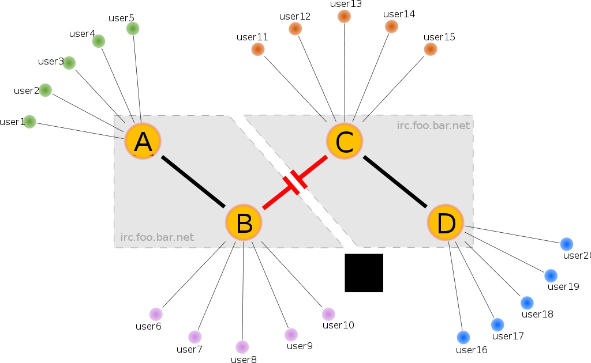
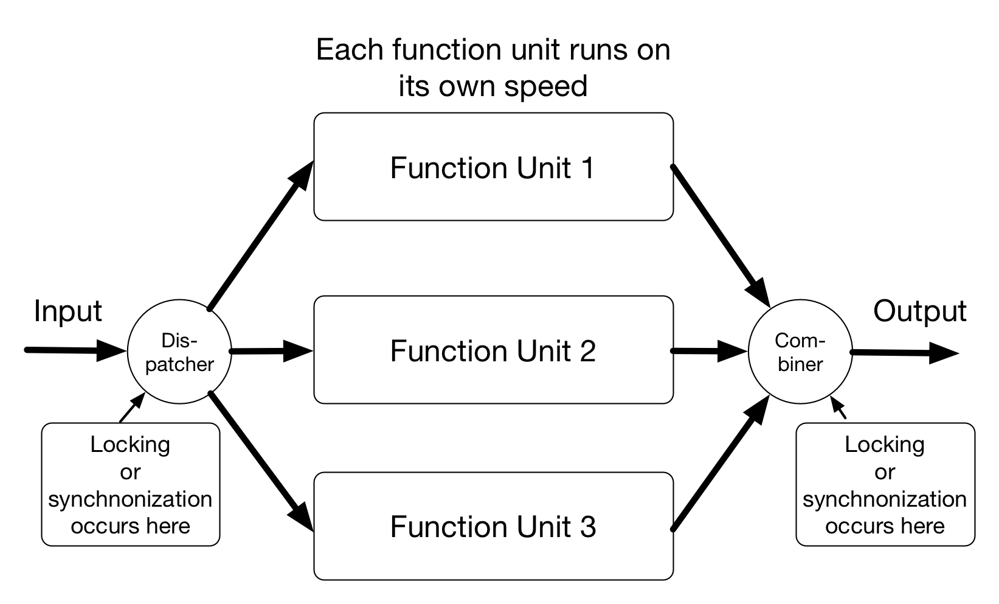
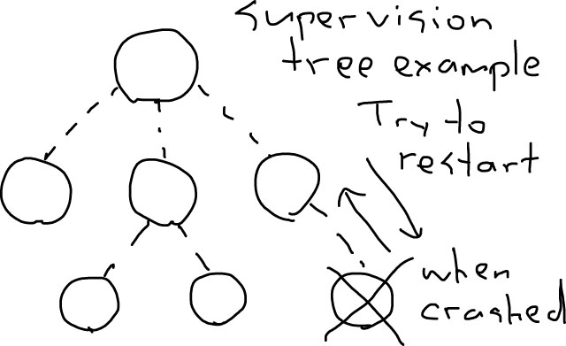

theme: Zurich
footer: Kenji Rikitake / oueees 20260623 topic05
slidenumbers: true
autoscale: true

# oueees-202606 topic 05:

- Network fault-tolerance
- Network services and programming trends

<!-- Use Deckset 2.0, 16:9 aspect ratio -->

^ 大阪大学基礎工学部 電気工学特別講義 2026年6月23日分 トピック05 ネットワークサービスとプログラミングのトレンドについての話を始めます。

---

# Kenji Rikitake

23-JUN-2026
School of Engineering Science, The University of Osaka
On the internet
@jj1bdx

Copyright ©2018-2026 Kenji Rikitake.
This work is licensed under a [Creative Commons Attribution 4.0 International License](https://creativecommons.org/licenses/by/4.0/).

^ 講師の力武 健次といいます。よろしくお願いします。

---

# CAUTION

The University of Osaka School of Engineering Science prohibits copying/redistribution of the lecture series video/audio files used in this lecture series.

大阪大学基礎工学部からの要請により、本講義で使用するビデオ/音声ファイルの複製や再配布は禁止されています。

^ 大阪大学基礎工学部からの要請により、本講義で使用するビデオ/音声ファイルの複製や再配布は禁止されています。ご注意ください。

---

# Lecture notes and reporting

* <https://github.com/jj1bdx/oueees-202606-public/>
* Check out the README.md file and the issues!
* Keyword at the end of the talk
* URL for submitting the report at the end of the talk

^ レクチャーノートはGitHubのこのURLに掲載しています。

---

# [fit] Network fault-tolerance

^ 今回はネットワークの耐障害性あるいはフォールトトレランスについて話します。

---

<!-- talk contents here -->

[.background-color: #ffffff]

^ この図の左の集中型ネットワークでは中心が壊れると全体が機能しなくなります。一方、右の分散型ネットワークではどれかひとつノードが壊れても後のノード間の通信はそのまま機能します。これにはどのノードも隣接している他のノードに接続されていることが理由です。

---

# Networks *split*

^ とはいえ実際の運用では、一つだったネットワークが2つに分かれてしまうことがあります。これをネットワーク分割、あるいはネットスプリットといいます。

---
[.background-color: #ffffff]

^ これはインターネットリレーチャット(IRC)のサーバー間ネットワークが切れて分割されてしまった例を示しています。ABCDの4つのサーバがつながっていたのが、BとCの間で切れてしまい、A-BとC-Dの2つのネットワークになってしまいました。

---

# Partition/fault tolerance: distributed systems should not stop working even if netsplit occurs

^ 実際の運用では、ネットスプリットが起こっても、システム全体として見たときの運用は続けられるようにしておく必要があります。切れている間分割されたそれぞれのネットワークでは別々に物事が進んでいくので、整合性が取れなくなります。整合性を取るには、接続が回復するのを待つ必要があります。

---

# Real-world challenges

* Natural disasters
* Device failures
* Human operation errors
* Political impediments
* Social resentments

^ システムあるいはネットワーク障害の原因としてはさまざまなものがあり得ます。地震などの自然災害、機器の故障、人間の操作ミス、政治的な障壁、あるいは社会的な敵意など、思いもよらないことが理由で動かなく、あるいは動かせなくなることがあります。

---

# Handling *failures*

* Redundancy: keeping backup units ready
* Fault tolerance: keeping systems running even the components fail
* Resilience by failing fast: early detection of failures and invocation of the recovery procedures

^ このような障害に対処する方法としては、バックアップあるいは予備の機材などを用意して冗長性を持たせるやり方があります。そしてシステムそのものに耐障害性を持たせて、部品が壊れても動作し続けるようにするのも一つの方法です。また、早く障害あるいは故障を発見し復旧手順を起動するという、failing fastという考え方もあります。

---

# Why fault tolerance?

* Hard disk MTBF ~= 1 million hours
* 1000 hard disks running 24 hours x 365 days = 8.76 million  hours
* If you're running a system with 1000 hard disks, **9 out of 1000** will fail in a year
* Recovery of a disk content takes often *a day*; you can't stop a system for *a day*, can you?

^ システムに耐障害性を持たせる必要性について考えてみましょう。ハードディスクの平均故障間隔MTBFは100万時間です。仮に1000台のハードディスクが1年間動作し続けると、延べ動作時間は876時間になります。つまり、1年間に9台は壊れるわけです。ハードディスクの内容復旧には1日は見ておかないといけません。システムを予告なく1日止めるというのは現代社会では許されないことです。

---

# Requirement to keep the systems fault tolerant

* Redundancy: two or more resources for each unit of processing
* Supervising the failure of the units by an independent supervisor
* Rollback capability: undo the incomplete operations and retry

^ 耐障害性を持たせるための要件について考えてみます。まずそれぞれのCPUやストレージといった処理要素に対して、2個以上用意して冗長性を持たせる必要があります。また個々の機器について、独立したスーパーバイザという管理プログラムで故障を監視しないといけません。さらに、故障が原因で完了しなかった処理についてやり直しをするロールバックと再試行/リトライができることが必要になります。

---

# Consistency issues of distributed systems

* Locking/synchronization: waiting all data to be ready to compute or proceed to next step
* Choosing the *right* data: which data is *correct*?
* Supervision: fault detection and restarting

^ 耐障害性の実現は分散システムでは一貫性/consistencyの問題になります。具体的にはロックや同期といった、処理に関連するデータが全部準備されていて処理ができるかどうかの確認作業が必要です。また同じ項目について複数の違うデータが存在する場合、どのデータが正しいのかを判定する必要があります。また、故障を監視して、発生した場合は速やかに該当部分を切り離したり再起動する必要があります。

---
[.background-color: #ffffff]

^ この図では一つの作業を3つの処理ユニットに分散させて出力を得ています。この場合、入力からユニットへのデータの振り分け、そして処理ユニットからの結果をまとめる作業、それぞれで同期を取る必要があります。パケット交換の場合と同じく、結果の到着の順番は予測できません。また、ユニットでの処理が失敗する可能性も考える必要があります。

---
[.background-color: #ffffff]

^ この図はスーパバイザが階層構造を持つ例です。それぞれのスーパバイザは、下位の処理プログラムあるいはスーパバイザが問題を起こして動作を止めてしまった時は、すぐにそれを検知し再起動を試みるという障害回復手順を実行します。

---

# Eight Fallacies of Distributed Computing[^3] (1/2)

* **The network is reliable**
* **Latency is zero**
* **Bandwidth is infinite**
* The network is secure

[^3]: <https://blog.fogcreek.com/eight-fallacies-of-distributed-computing-tech-talk/>

^ ここからは分散コンピューティングあるいはネットワークを使う上で仮定してはならないことについて、8つの誤謬、ということわざがあるので紹介します。ネットワークは信頼できるものではありません。遅延はゼロではありません。帯域幅あるいは伝送速度は無限ではありません。ネットワークは安全ではありません。

---

# Eight Fallacies of Distributed Computing (2/2)

* Topology doesn't change
* There is one administrator
* Transport cost is zero
* The network is homogeneous

^ ネットワークの組まれ方あるいはトポロジーは変わり得ます。管理者として交渉すべき相手は一人ではありません。トランスポートを使うコストはゼロではありません。ネットワークは均一なものではありません。…しかし実際には多くのネットワークが理想的な条件を仮定して作られて、運用上の問題を引き起こしています。

---

# Summary: centralized computing is fragile; distributed computing is fault tolerant but hard

^ ここまでの話をまとめます。集中型のシステム構築は故障に対してとても弱いです。そこで中心を持たない分散システムにして耐障害性を持たせるわけですが、その作業はとても難しいです。言い変えれば、今のインターネットやクラウドコンピューティングは、この難しい作業を注意深く実行しているからこそ成り立っているともいえます。

---

# Network services and programming trends

* Becoming hybrid and more complex, many different parts
* Web design: user experience (UX), accessibility, usability
* Development: database, web frontend, web backend
* Site Reliability Engineering (SRE), infrastructure and operation
* Security: vulnerability assessment, incident response

^ ここからはネットワークサービスとプログラミングのトレンドについての話をします。最近のネットワークサービスは複数の違う要素が組み合わさってハイブリッド化しています。Webデザインもユーザー体験(UX)や障害のある人達へのアクセシビリティ、使いやすさが求められています。開発もデータベース、Webフロントエンドとバックエンドという形に分かれています。これらを運用する際はSite Reliability Engineering (SRE)という運用方法に基づく24時間態勢のサポートを行う必要があります。そして脆弱性検査やインシデント対応などのセキュリティ対策が必要です。

---

# Why learning programming?

- Programming = making software
- Programming is the only way to fabricate a system
- Computers can only do their job through programming 
- It's often *you* not someone else must write the code
- You need to *verify and prove* correctness of code written by AI

^ これらのサービスを実現していくには、もはやプログラミングは不可欠といっていいと思います。ソフトウェアを作り、システムをソフトウェアから作り、人間では不十分な仕事をコンピュータにプログラミングを介してさせることが必要になってきています。そしてプログラミングはもはや誰かがやってくれるものではなくて、自分でやらなくてはならない作業になっています。仮にAIを使ったとしても、出てきたコードを検証して責任を持つのは人間の仕事です。

---

#  Programming is:

- A language
- There are various languages which fit and don't fit your requirement
- There are no good or bad programming languages

^ プログラミングの主な要素として、言語で表現するということがあります。今は非常に多くのプログラミング言語があって、自分の要求に合うものと合わないものがあります。これは言語の善し悪しとは関係のない話です。

---

# Modern software development: team, library, and ecosystem

* Development as a *team*, not just individual
* Depending on *libraries*, not just newly-written code
* Depending on the *ecosystem*, not just you and your team

^ 現代のソフトウェア開発では、個人でなくチームでやること、新しく書き下ろすだけでなく過去のライブラリに大きく依存すること、そして結果の品質が自分の所属するチームだけではなくその言語を使う人達のコミュニティや環境といったエコシステム全体に依存する、という要素を考える必要があります。

---

# So what to learn?

* Popular ones (C++, JavaScript/TypeScript, Python)
* *Required* ones by your tasks (old languages)
* For lesser-known domains, experiments and prototyping (esoteric languages)
* Learning a programming language can change your mind and how you work
* How to program with AI (Claude Code, Codex, etc.)

^ どんなプログラミング言語を学べばいいかという話は巷でも頻繁に出てくるんですが、まずは有名なものから学んでみる、というのは有効だと思います。新しい言語である必要もなくて、まずはやりたいことあるいはやらないといけないことができるものを学ぶのがいいでしょう。実験のためにはそれ専用の言語を学んでもいいと思います。言語を学ぶことで考え方も変わりますし、より柔軟な思考を身に付けられるはずです。そしてAIを使ってプログラムを書く術も学ぶ必要があるでしょう。大規模なプログラム相手の作業の際は人間だけでは見切れないこともありますから。

---

# My suggestions: Erlang/Elixir for concurrency

* Concurrency is the key for distributed network programming
* Erlang for learning the basic functional programming
* Elixir for applying functional programming for web
* Disclaimer: these languages are not necessarily popular, but will surely change how you understand computer programming

^ 私は個人的にはErlangとElixirという言語システムをお勧めしています。これらは分散ネットワークプログラミングで必要な並行処理の記述に適していて、基礎的な関数プログラミングの勉強にもなりますし、特にElixirはWebプログラミングにも適しています。著名な言語ではないですが、他のポピュラーな言語とはまったく違った考え方を必要とするので、プログラミングに対する認識が変わると思います。

---

# [fit] すごいErlangゆかいに学ぼう!

- オーム社 ISBN 9784274069123
- [達人出版会の電子書籍](https://tatsu-zine.com/books/sugoi-erlang-ja)

^ これはErlangを学ぶための日本語の書籍の例です。Erlangだけでなく、どうやって耐障害性を実現するかという意味でも参考になる本です。

---

# [fit] プログラミングElixir 第2版

- オーム社 ISBN 9784274226373
- [達人出版会の電子書籍](https://tatsu-zine.com/books/programming-elixir-2ed)

^ こちらはElixirを学ぶための日本語の書籍の例です。言語の基本全般について書かれています。今回のトピックの話はこれで終わります。この後にキーワードがあります。

---

# Photo and image credits

* All photos and images are modified and edited by Kenji Rikitake
* Photos are from Unsplash.com unless otherwise noted

<!-- Photo and image credits here -->

* Networks: Irina Blok
* Networks Split: Pietro De Grandi
* Netsplit: <https://commons.wikimedia.org/wiki/File:Netsplit_split.svg>, in public domain

<!--
Local Variables:
mode: markdown
coding: utf-8
End:
-->
