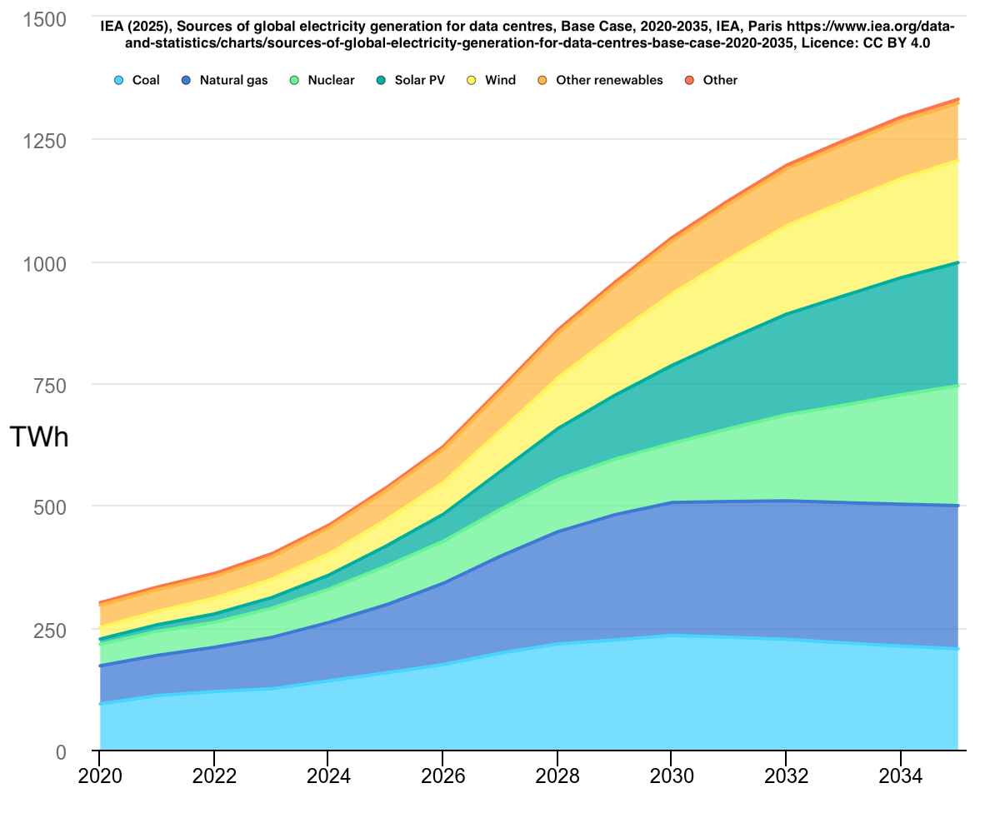

theme: Zurich
footer: Kenji Rikitake / oueees 20260623 topic08
slidenumbers: true
autoscale: true

# oueees-202606 topic 08:

AI or "Artificial Intelligence"

- What is it?
- The philosophical implication
- How it has changed the society

<!-- Use Deckset 2.0, 16:9 aspect ratio -->

^ 大阪大学基礎工学部 電気工学特別講義 2026年6月23日分 トピック08 AIあるいは人工知能、そしてその哲学的また社会的影響についての話を始めます。

---

# Kenji Rikitake

23-JUN-2026
School of Engineering Science, The University of Osaka
On the internet
@jj1bdx

Copyright ©2018-2026 Kenji Rikitake.
This work is licensed under a [Creative Commons Attribution 4.0 International License](https://creativecommons.org/licenses/by/4.0/).

^ 講師の力武 健次といいます。よろしくお願いします。

---

# CAUTION

The University of Osaka School of Engineering Science prohibits copying/redistribution of the lecture series video/audio files used in this lecture series.

大阪大学基礎工学部からの要請により、本講義で使用するビデオ/音声ファイルの複製や再配布は禁止されています。

^ 大阪大学基礎工学部からの要請により、本講義で使用するビデオ/音声ファイルの複製や再配布は禁止されています。ご注意ください。

---

# Lecture notes and reporting

* <https://github.com/jj1bdx/oueees-202606-public/>
* Check out the README.md file and the issues!
* Keyword at the end of the talk
* URL for submitting the report at the end of the talk

^ レクチャーノートはGitHubのこのURLに掲載しています。

---

# "Artificial Intelligence" (AI)

## Fundamental question: *is intelligence only for human?*

^ 最初は人工知能あるいはAI、そしてその現実はどのようなものなのかということについて話します。まず基本的な質問として、「知能は人間だけが持つものか?」ということを提示したいと思います。そもそも知能とは何かという定義上の問題もありますが。この講義では答は出しません。いろいろな見解があると思います。

---

# What is intelligence?

> Intelligence has been defined in many ways: the capacity for abstraction, logic, understanding, self-awareness, learning, emotional knowledge, reasoning, planning, creativity, critical thinking, and problem-solving. [^1]

[^1]: [Intelligence](https://en.wikipedia.org/w/index.php?title=Intelligence&oldid=1354769818), Wikipedia, (last visited June 21, 2026).

^ 「知能がある」とはどういうことなのか、ということですが、抽象化、論理思考、物事の理解、自己認識、学習、心を扱う能力、理性による推論、企画力、創造性、批判的思考、問題解決の能力など、いろいろな側面があります。これらが重層的に組み合わさって、人間の知能を形作っています。

---

# What is *artificial* intelligence?

> Artificial intelligence (AI) is the capability of computational systems to perform tasks typically associated with human intelligence, such as learning, reasoning, problem-solving, perception, and decision-making. [^2]

[^2]: [Artificial intelligence](https://en.wikipedia.org/w/index.php?title=Artificial_intelligence&oldid=1360229963), Wikipedia, (last visited June 21, 2026).

^ では「人工知能」とはなんなのか、ということですが、具体的には計算システムのタスクを処理する能力のうち、人間の知能に関連するもの、例えば学習であったり、推論、問題解決、事物の認知、そして意思決定などを指しています。さらに具体的には、知識を表現すること、作業の計画、自然言語の処理、そしてロボティクスに基づく機械の操作なども含みます。

---

# AI as a buzzword in computer science (1/2) [^3]

* LISP and "symbolic" (text) processing (1950s)
* AI Winter in the 1970s
* Logic programming / expert systems (1980s)
 - Japan: The Fifth Generation Computer Systems (1982-1994)
* AI Winter in the 1990s

[^3]: Wikipedia contributors, [History of artificial intelligence](https://en.wikipedia.org/w/index.php?title=History_of_artificial_intelligence&oldid=1159316271), Wikipedia, The Free Encyclopedia, 9 June 2023, 15:53 UTC [accessed 13 June 2023]

^ AIという単語はコンピュータサイエンスの中で何度もバズワードとして出てきました。1950年代には文字列の処理、当時は記号処理といったプログラミングのために、LISP言語が登場しました。その後1980年代には日本が主導した第5世代コンピュータプロジェクトなど、論理プログラミングやエキスパートシステムをAIとして扱う流儀が流行りました。とはいえ、AIの実現には膨大な計算機の力が要るため、1970年代と1990年代には「AIの冬」と呼ばれる停滞期を迎えています。

---

# LISP language: code is data [^4]

```lisp
(defun add (a b) (+ a b))
(format t "2 + 3 = ~a~%" (+ 2 3))
(format t "cdr add = ~a~%"
  (cdr (quote (defun add (a b) (+ a b)))))
```
```
2 + 3 = 5
cdr add = (ADD (A B) (+ A B))
```

[^4]: [Online Lisp Interpreter](https://www.tutorialspoint.com/compilers/online-lisp-compiler.htm), running SBCL 2.0.0

^ LISP言語によるプログラミングの例を示します。この例ではまずaddという足し算の関数を定義して、2足す3は5という計算をしています。次に、この関数定義そのものもLISPではリストというデータとして扱えるので、そのリストの中で最初の要素だけ取り除いた残りを示すcdr（クッダー）という関数で処理をすると、addの関数の定義の内容、実際にはdefunというマクロへの引数が取り出せます。このようにして、LISPではプログラムそのものを別のプログラムで処理をするという技法を実現しています。

---

# AI as a buzzword in computer science (2/2)

* Breakthrough made by large-scale computing
  - Internet, massive parallelism, cloud computing
* Since 2010s: generative AI
  - Machine learning -> deep learning
  - Massive "big data" from the internet
  - Large language models (LLMs) (e.g., GPT-5.5)

^ その後大規模計算のための技術が著しく進歩したことで、2010年代からは、現在のChatGPTなどの基礎技術である生成AI(generative AI)の実用化が進んでいきます。インターネットや大規模並行並列計算、クラウドコンピューティングなどで集めて処理された大量のデータをもとに、機械学習とそれを発展させた深層学習のモデルを作ることができるようになり、その中の大規模言語モデル(LLM)として今のChatGPTの背景であるGPT-5.5などが出てきています。

---

# Logical certainty .vs. probabilistic certainty

- Determinism: all events within the universe can occur only in one possible way [^5]
- Logical reasoning: deduction or non-deductive ones (induction / abduction)
- Traditional algorithms assume determinism and deduction; obviously idempotent
- AI introduces *statistical* reasoning and *learning* algorithms 

[^5]: [Determinism](https://en.wikipedia.org/w/index.php?title=Determinism&oldid=1355781285), Wikipedia (last visited June 21, 2026).

^ ここで確実性(certainty)ということについて考えてみます。近代の科学は、基本的に決定論、つまり何かが起こるのはそれ以前の状態から必然的に変化した唯一の結果である、という因果的決定論の立場に基づいています。そしてその背後には、論理的な推論、たとえば原因から結果を導き出していく演繹的推論が前提になっています。もっとも、その演繹的な立場に至るまでは、帰納的な推論、つまり個別事例から一般的な法則を見い出そうとするやり方、そしてアブダクションと呼ばれる、結論から結論に至る前提を推論するやり方が広く使われています。伝統的なコンピュータアルゴリズムでは決定論と演繹的推論が仮定されていて、同じ入力であれば同じ結果に至るという仮定がされています。この立場では確実性というのは、正しいか正しくないかの2値で示されます。一方、AIでは、統計的な推論、つまり確からしさの評価と、学習するアルゴリズムを使うようになっています。これらのアルゴリズムは2値の出力ではなく、実数で示される幅を持った結果が出るようになっています。

---

# How probability is misunderstood

- When the probability of an event is high, that does *not necessarily* mean the event will *always* happen 
- Expected values do *not necessarily* represent the risk; *outliers matter*
- Normal distribution does *not necessarily* describe the whole set of actual samples

^ 私も統計学に詳しい訳ではないんですが、いくつか確率については注意しておくべきことはあります。まず、ある事象が起こるという確率が高いからといって、その事象がいつも必ず起こるわけではありません。同様に確率が低いからといってまったく起こらないわけではないということです。また、統計での期待値は必ずしもリスク、つまりどれくらい危険なのかを示す指標ではない、ということもあります。しばしば外れ値(outliers)が問題になることが多いです。ネットワーク運用でも、平均値ではなく、最悪値を抑える設計をしなければならないことが多々あります。同様に、物事のバラツキについて、正規分布を仮定して考えることが多いですが、実際の値のサンプルを集めてみると、正規分布とかけはなれてしまうことも多々あります。

---

# AI needs data; how are they collected? (1/2) [^6]

They are all collected *via the internet*

- Public web data: articles, blog posts, digitized books, academic papers, and forums
- Source code: Massive repositories of public and open-source code, technical documentation, and scripts
- Visual data: Billions of images, photos, artwork, diagrams, and charts

[^6]: [A conversation record between Kenji Rikitake and Gemini 3.5 Thinking](https://gist.github.com/jj1bdx/b6b2576a81f783d9c5857055d099e4b9)

^ AIは動作させるために大量のデータを必要とします。これらは一言でいえば、すべてインターネットから収集されています。公開されたブログや論文などのWebからのデータ、公開されたオープンソースソフトウェアのコードやドキュメント、静止画の写真や図などを使っています。このことは私がGoogle Workspaceで使えるGeminiに聞いてみました。

---

# AI needs data; how are they collected? (2/2)

- Audio files: podcasts and speech recordings
- Videos: video frames and transcripts, such as filtered YouTube content
- Synthetic & human-curated alignment data: models undergo specialized training using Supervised Fine-Tuning (SFT) and Reinforcement Learning from Human Feedback (RLHF)

^ テキストや静止画の他にも、ポッドキャストなどの音声ファイル、動画、そして教師付きファインチューニングやフィードバックによる強化学習を人間が行った補正（alignment）データなども、AIの学習データには含まれています。

---

# Question: can you respect and retain copyright / intellectual property rights, privacy and security of these collected data and the owners?

^ ここで考えなければならないのは、収集されたデータの著作権に始まる知的所有権と、プライバシーとセキュリティの問題は尊重されて守られるのか、ということです。

---

# AI ignores the origins of data and questions

- You can prompt AI of revealing sensitive data
- You cannot protect any specific data in AI models from *unwanted* revelation
- AI is an algorithm and will not *proactively* act for protecting *sensitive* data

^ 現実問題として、AIはデータや質問の出所について、正しく把握した返答はできません。個別のデータに対して、望まない開示を避けるように保護することもできません。AIはアルゴリズムなので、機微情報を保護することを情報が利用される前に事前に行うこともできないでしょう。

---

# Can AI be legally creative? Unfortunately no

- AI doesn't really care about plagiarism
- AI can generate wrong output quite often 
- AI won't be able to handle copyright details

^ 現状のAIが合法的に創造性を発揮できるかといったら、そうではないと言わざるを得ません。今のAIは剽窃、つまり他人の作品を盗むということには無頓着ですし、間違った出力を頻繁に出します。そしてAIは著作権の詳細をうまく扱うこともできないでしょう。

---

# Half of music professional refuse AI-generated music [^7]

Survey of 144 music supervisors, filmmakers, and advertisers by leading music companies
- 97% want to know if music is AI-generated
- 49% will only work with human-made tracks
- 40% said cultural authenticity becomes a critical selection factor

[^7]: ["Industry survey reveals 97% of music professionals demand AI transparency, while half refuse AI-generated music entirely"](https://www.recordoftheday.com/on-the-move/news-press/industry-survey-reveals-97-of-music-professionals-demand-ai-transparency-while-half-refuse-ai-generated-music-entirely), Record of the Day, 02 Dec 2025

^ 昨年2025年12月の代表的な音楽事業者144人に対するイギリスでの調査によれば、97%の人達が曲がAI生成されているかどうかを知りたいと回答し、49%の人達は人間が作った曲しか相手にしないと述べています。そして40%の人達がアーティストの文化的信憑性が重要であるとも述べています。

---

# Revisiting history of sampling music [^8]

- Modern hip-hop and many other pop music consist of samples from other people's pieces of works (drum breaks, impressive phrases, voices, etc.)
- Sampling technology emerged since 1980s, now pervasive everywhere even on your smartphone [^9]
- *The copyright issues are still in huge controversy*


[^8]: [Sampling (music)](https://en.wikipedia.org/w/index.php?title=Sampling_(music)&oldid=1359206729), Wikipedia (last visited June 21, 2026).

[^9]: For example, [Koala Sampler](https://www.koalasampler.com/)

^ AIによる創造性の侵害、ということを考えた時に、復習しておく必要があるのは、音楽におけるサンプリングの歴史です。1980年代から発展してきたサンプリング技術は今や皆さんのスマートフォンで問題なく動作するようになっています。そして音楽の一大ジャンルであるヒップホップでは、その中のドラムや印象的なフレーズ、そして声などに大量のサンプル、つまり他の作品からコピーして編集したものを使っています。現代の音楽著作権の仕組みでは、作品の一部に関する再配布の権利は著作権者にあり、許可を受けずに自分の作品に利用することは著作権侵害にあたります。これについては基本的に当事者同士で解決する仕組みになっているため、2020年代後半の今も紛争が絶えません。

---

# Resolving legal issues caused by AI-generated music and other forms of art might take many years

- AI output can be an ill-formed sampling
- AI-generated output is quite often inconsistent
- AI-generated output is derived from other people's data; identifying the source and owners is extremely difficult and virtually impossible

^ AIが生成した音楽そして他の形式の芸術作品について発生した法的問題を解決するには何年もかかると思います。AIの出力は完全ではないので、著作権違反にならないように出力を仕上げることは容易ではありませんし、同じ出力を再現しようとしてもできないことがしばしばあります。そして本質的な問題として、AIの出力は他の人達のデータに基づくものであり、その情報源や所有者を特定することは極めて難しく事実上不可能である、ということがあります。ここではあえて絵画やイラスト、そして動画の問題は述べませんでしたが、音楽以上に深刻な状況であることは世の中に報道されている通りです。

---

# The (non-)goals of current AI

* *Non-deterministic* problem solving
  - Probabilistic answers computed by neural networks
  - Questionable reproducibility
  - *Errors may quite often occur*
* *No one really knows why* LLMs work and what they actually do
  - You cannot *fully logically* explain the behavior

^ 今の生成AIが何を目指しているかについて述べます。基本的にはニューラルネットワークによる確率的に確からしい非決定的な出力を出すようにAIはできています。ですからしばしば間違えますし、同じ答を必ず出してくれるわけではありません。そしてLLMが中で何をやっていてどうして出力が出てくるかについては誰も理解していない、というのがAI研究者の人達の見解です。言い換えれば、完全に論理的にLLMのふるまいを説明できるわけではありません。ここが従来の「コンピュータは必ず正しい結果を出す」という思い込みを捨てなければならないところです。

---


^ これはこの講義で使おうとして挫折したGeminiが生成した図です。いろいろと間違いがあるのですが、繰り返して指示を与えても直りませんでした。

---

# Generative AI can only *estimate* answers

* Don't: expect the definitive answers
* Do: treat the output as the *synthesized* summary
  - The behavior is limited by the *given data*
  - Prompting (directives by words) largely affects the output
* Do: review the output by yourself
* *Don't: blindly believe the answers!*
* *Also don't: use the output without proper citation*

^ 生成AIができることは、せいぜい答を推測することでしかありません。決定論的な答を期待してはいけないと思います。一方で、生成AIの出力は入力を合成してまとめたものといえますし、プロンプトという指示の与え方で大幅に出力は変わります。出力結果は使用者が自分でレビューすることが必要ですし、そのまま信じてはいけないものです。また、AIの出力結果は使ったAIの名前などを適切に引用することが必要です。

---

# Generative AI (AI) raises fundamental and phylosophical questions on making decisions

* AI outputs are probabilistic at best and is *not 100% deterministic*
* Modern science relies on deterministic logic for precision; should we give up precision for fast estimation using AI?
* Consequently, AI will induce more distrust against science

^ 生成AIの隆盛は意思決定についても重要な哲学的問題を提起しています。AIの出力は良くて確率的なものでしかなく、100%決定論的に導き出されることはありません。現代の科学は決定論にその精度を依存しています。AIによる高速な推定ができるからといって、精度の追求を放棄していいのでしょうか。そしてその結果として、AIはさらに科学に対する不信を呼ぶだろうと思います。

---

# Social dehumanization and failures by AI

* Klarna hired back laid off 700 agents, once replaced with AI, failed to address the complex 20% of interactions [^10]
* AI-assisted software development puts huge burden on human developers [^11]
* "[...] even if people think AI recommendations are low quality or not important, their decisions are still vulnerable to AI bias under certain circumstances." [^12]

[^10]: Ashutosh Singhal, [Klarna Replaced 700 Agents with AI. Then Hired Them All Back.](https://www.linkedin.com/pulse/klarna-replaced-700-agents-ai-hired-them-all-back-ashutosh-singhal-tk2jc/), May 2, 2026

[^11]: S. Baltes,  M. Cheong and C. Treude, ["An Endless Stream of AI Slop": How Developers Discuss the Burden of AI-Assisted Software Development](https://arxiv.org/abs/2603.27249)

[^12]: Wilson, K., Sim, M., Gueorguieva, A.-M., & Caliskan, A. (2025). No Thoughts Just AI: Biased LLM Hiring Recommendations Alter Human Decision Making and Limit Human Autonomy. Proceedings of the AAAI ACM Conference on AI, Ethics, and Society, 8(3), 2692–2704. <https://doi.org/10.1609/aies.v8i3.36749>

^ AIは企業の各種活動にも採用されていますが、それらがマイナスの結果をもたらしている例も少なくありません。スウェーデンのフィンテック企業Klarnaは顧客対応で700人解雇してAIに置き換えたものの、AIでは顧客対応件数のうち複雑なもの2割に対応できず、結局また人間を雇ったという失敗例があります。また、AIを使ったソフトウェア開発では、その結果のレビューに膨大な人間の負担がかかっているとする論文もあります。人事採用においてAIが差別的対応をしているという例は顕著に見られますが、仮に人間が支援したとしても、人間の側が問題のある意思決定に影響されてしまうという研究論文もあります。

---

# Environmental implication of AI *(Electricity alone)*

> "Global electricity generation to supply data centres is projected to grow from 460 TWh in 2024 to over 1 000 TWh in 2030 and 1 300 TWh in 2035 in the Base Case. Over the next five years, renewables meet nearly half of the additional demand, followed by natural gas and coal, with nuclear starting to play an increasingly important role towards the end of this decade and beyond."
-- IEA (2025), Energy and AI, IEA, Paris <https://www.iea.org/reports/energy-and-ai>, Licence: CC BY 4.0

^ AIの環境に与える影響は無視できないものになっています。国際エネルギー機関（IEA）の2025年の報告によると、世界のデータセンターに対する電力供給は2024年の460TWhから2030年には1000TWh、2035年には1300TWhに達するだろうとされています。これらのうち再生可能エネルギーは半分を占めるものの、今後原子力発電の役割が2020年代の終わりからさらに先にかけて大事になってくるでしょう。日本では経済産業省資源エネルギー庁の2024年度分推計で年間供給実績は853.75TWh（8537.5億kWh）という数字が出ていますので、今後は日本一国分以上の電力消費が世界的にデータセンターに使われるという予想がなされていることになります。

<!-- https://www.enecho.meti.go.jp/statistics/electric_power/ep002/pdf/2024/0-2024.pdf -->

---



^ これはIEAの予測をエネルギー源の種別ごとに示したグラフです。石炭も天然ガスもも2030年で頭打ちになりますが、原子力はその後も増え続けるという予想がされています。日本は歴史的理由、そして2011年の東日本大震災以来原子力アレルギーともいえる状況が続いていますが、韓国も中国も原発をエネルギー需要の増加に伴い原子力発電所をどんどん作っているという現実は無視するわけにはいかないでしょう。

---

# Is investment to AI worth it? Does it enough good to the society equivalent to how people have paid for it?

^ 最後にこれは皆さんに考えてみて欲しいのですが、AIへの投資は意味あるものでしょうか。AIに払ったお金やその他の価値に見合っただけの見返りを私達は得ているでしょうか。この質問を最後に、このトピックを終わります。最後にキーワードがあります。

---

# Photo and image credits

* All photos and images are modified and edited by Kenji Rikitake
* Photos are from Unsplash.com unless otherwise noted
* Free Wifi Inside: [Photo by Bernard Hermant](https://unsplash.com/photos/X0EtNWqMnq8)
* Pedestrians: [Photo by Ryoji Iwata](https://unsplash.com/photos/IBaVuZsJJTo)

<!--
Local Variables:
mode: markdown
coding: utf-8
End:
-->
